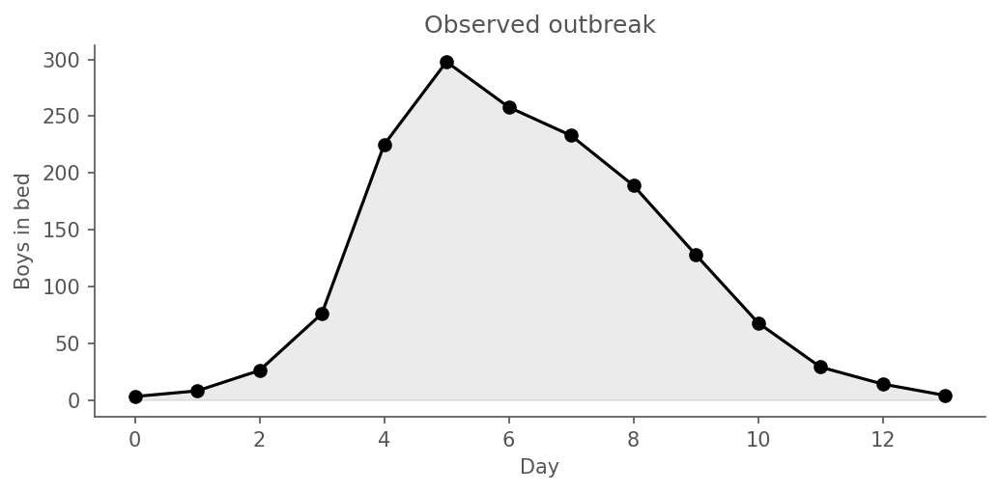

In the [previous chapters](../guide/experiments.qmd) we built a model, explored its
uncertainty, and tested its behavior under different scenarios. Now we turn
to the central question: **can the data constrain the model's parameters?**

This chapter fits an SIR model to the 1978 boarding school influenza
outbreak using iterated filtering (IF2), and discovers how much 14 daily
observations can — and can't — tell us about the underlying epidemic.


## The problem: latent states and intractable likelihoods

A compartmental model has **latent states** — the true number of susceptible,
infectious, and recovered individuals at each time point — that we never
observe directly. We observe noisy, incomplete proxies: daily bed counts,
weekly case reports. To find the parameters that best explain the data, we
need the likelihood $L(\theta \mid y_{1:T})$ — the probability of seeing
these observations given the parameters.

For a stochastic compartmental model, this likelihood is an integral over
all possible latent epidemic trajectories:

$$
L(\theta \mid y_{1:T}) = \int P(y_{1:T} \mid x_{0:T}, \theta) \; P(x_{0:T} \mid \theta) \; dx_{0:T}
$$

This integral is intractable — the space of possible trajectories is
enormous. The **particle filter** approximates it by simulating many
trajectories in parallel and weighting them by how well they explain the
data. **Iterated filtering (IF2)** [Ionides et al. 2015](https://doi.org/10.1073/pnas.1410597112)
builds on this: it perturbs the parameters across the particles,
runs the particle filter, and then cools the perturbations over
iterations to converge on the maximum likelihood estimate (MLE). Think
simulated annealing on an approximate likelihood surface. This is the
same algorithm as pomp's `mif2()`.


::: {.callout-warning appearance="default"}
## A hazard worth naming: backend consistency

This chapter spent **two days** convinced that the simple SIR could not
reproduce the observed outbreak. The "evidence" was a posterior-predictive
plot at the fitted MLE that systematically undershot the rising limb by
~100 boys. The cause was not the model — it was a **backend mismatch**:
the fitting pipeline used `chain_binomial` (discrete-time integer states,
dt = 1 day) while the simulation helper defaulted to `gillespie`
(continuous-time exact CTMC). These are different dynamical systems at
the same parameters. Simulating the MLE under the wrong backend produces
a misleading PPC with no warning.

Upstream has since shipped a **provenance guardrail** (`camdl` version
`0.1.0+ce192db`, 2026-04-19): `camdl simulate --params <fit MLE>`
now reads the fit's backend from the MLE file and either auto-matches
it (silent, with an info log) or warns loudly if the user explicitly
passes a mismatched backend. The incident write-up lives at
`docs/dev/incidents/2026-04-19-backend-default-mismatch.md` in the
camdl repo. We pin `--backend chain_binomial --dt 1.0` explicitly in
this chapter for reader clarity, even though the guardrail now makes
this redundant.

**Practical lesson for anyone fitting SSMs:** when you simulate forward
from a fit's MLE, the simulator backend must match the fit's backend.
If your tool doesn't have a provenance guardrail, check by hand.
:::

## The data

14 daily observations of boys confined to bed during the 1978 English
boarding-school influenza A/H1N1 outbreak (N=763 total students). This
is a closed-population, short-duration dataset — ideal for teaching SIR
fitting because the outbreak plays out fully within the observation window.

```{python}
#| echo: false
import polars as pl
import matplotlib.pyplot as plt, matplotlib as mpl
from pathlib import Path
ROOT = Path(".")
GREY = "#555555"
mpl.rcParams.update({"figure.dpi":150,"font.size":10,"axes.edgecolor":GREY,
    "axes.labelcolor":GREY,"xtick.color":GREY,"ytick.color":GREY,"text.color":GREY})
obs = pl.read_csv(ROOT/"data/in_bed.tsv", separator="\t")
fig, ax = plt.subplots(figsize=(7, 3.5))
ax.plot(obs["time"], obs["in_bed"], color="black", marker="o", linewidth=1.5)
ax.fill_between(obs["time"], 0, obs["in_bed"], color="black", alpha=0.08)
ax.set_xlabel("Day"); ax.set_ylabel("Boys in bed")
ax.set_title("Observed outbreak")
ax.spines[["top","right"]].set_visible(False)
fig.tight_layout()
fig.savefig("figures/obs.png", bbox_inches="tight"); plt.close(fig)
```

{#fig-obs}

Peak of 298 boys on day 5. By day 14 only a handful remain.

## The model

Plain SIR on a closed population of N = 763, with integer states and
chain-binomial dynamics at dt = 1 day. The full `camdl` source:

```{python}
#| echo: false
#| output: asis
print("```camdl")
print(Path("boarding_school_sir.camdl").read_text().rstrip())
print("```")
```

Two free parameters to estimate — β (transmission rate, per day per
infective) and γ (recovery rate, per day) — and one fixed initial
condition I(0) = 5 (from the BMJ report; we revisit this choice later).
Poisson observation is deliberate: matron daily counts are integer
counts from direct observation of sick boys, so Poisson is the natural
observation model (no dispersion parameter required). The `transitions`
block gives the rate expressions; the `chain_binomial` backend (pinned
in `fit.toml`) discretises these at dt = 1 day into integer-state Binomial
draws, which is what the IF2 particle filter runs on.

## Pipeline validation — recover known parameters first

Before fitting real data we should confirm the pipeline works *at all*:
simulate a dataset from known "guesstimate" parameters, fit with the same
IF2 procedure, and check that we recover the truth. If the pipeline can't
recover parameters it generated, it certainly can't be trusted on data
it didn't.

**Guesstimate parameters** (pandemic-flu-in-children, 1970s literature):

| parameter | value | rationale |
|---|---|---|
| β | 1.20 /day | transmission rate per infective |
| γ | 0.33 /day | mean infectious period ≈ 3 days |
| I(0) | 5 | matches the fit's fixed I(0) |
| N | 763 | known school size |
| R₀ | β/γ = 3.6 | pandemic-flu ballpark in a closed population |

These values differ from the real-data MLE (we'll see later: β ≈ 1.91, γ ≈ 0.66,
R₀ ≈ 2.9). If the IF2 pipeline on synthetic data drifts toward the real-data
basin, it's broken; if it lands near (1.20, 0.33), we trust it.

```{python}
#| echo: false
#| output: asis
import polars as pl
rec = Path("output/synthetic_recovery.tsv")
if rec.exists():
    s = pl.read_csv(rec, separator="\t")
    print("| parameter | truth | estimate | abs err | % err | refine Rhat |")
    print("|---|---|---|---|---|---|")
    for row in s.iter_rows(named=True):
        rhat = row['rhat']
        color = "#27ae60" if rhat < 1.05 else ("#e67e22" if rhat < 1.10 else "#c0392b")
        print(f"| `{row['param']}` | {row['truth']:.3f} | {row['estimate']:.3f} | {row['abs_err']:.3f} | {row['pct_err']:.1f}% | <span style='color:{color}'>{rhat:.3f}</span> |")
```

{#fig-synth-recovery}

Recovery within ~6% on β, ~0.1% on γ, both refine Rhat < 1.05. The PPC
envelope at the recovered MLE comfortably brackets the synthetic
observations. The pipeline works.

## Fitting with IF2

Iterated filtering ([Ionides et al. 2015](https://doi.org/10.1073/pnas.1410597112))
is a frequentist method for fitting state-space models via particle
filtering. Two stages: a **scout** that launches many chains widely to
map the likelihood surface, then a **refine** that takes top-K chains
by log-likelihood and zooms in with tighter random-walk perturbations.
Configuration is in `fit.toml`:

- Scout: 48 chains × 2000 particles × 250 iterations, cooling 0.9
- Refine: 12 chains × 4000 particles × 400 iterations, cooling 0.98,
  starts from scout's top-12 chains

```{python}
#| echo: false
#| output: asis
from pathlib import Path
def read_toml(p):
    d = {}
    for line in Path(p).read_text().splitlines():
        line = line.split("#",1)[0].strip()
        if "=" in line:
            k,v = line.split("=",1)
            try: d[k.strip()] = float(v.strip())
            except: pass
    return d

mle_path = next(Path("results/fits").glob("fit-*/real/fit_42/refine/mle_params.toml"), None)
state_path = mle_path.parent / "fit_state.toml" if mle_path else None

if mle_path and state_path and state_path.exists():
    mle = read_toml(mle_path)
    state_text = state_path.read_text()
    best_ll = None
    for ln in state_text.splitlines():
        if ln.startswith("best_loglik"):
            best_ll = float(ln.split("=")[1])
            break
    print(f"**MLE:** β = {mle['beta']:.3f}, γ = {mle['gamma']:.3f}, "
          f"I(0) = {int(mle['I0'])}, N = {int(mle['N0'])}. Log-likelihood = {best_ll:.1f}.")
    print(f"\nR₀ = β/γ = {mle['beta']/mle['gamma']:.2f}; "
          f"mean infectious period = {1/mle['gamma']:.2f} days.")
else:
    print("_(fit not yet run — see instructions below)_")
```

### Running the fit

```bash
camdl fit run fit.toml --seed 42
```

Output lands at `results/fits/fit-<hash>/real/fit_42/refine/mle_params.toml`
under the content-addressable tree.

### Convergence check

Every claim in this chapter depends on the fit having converged. The
headline diagnostic is split-Rhat per estimated parameter on the refine
stage's chain traces. Rule: all refine Rhat < 1.10 is required; < 1.05
is preferred. Scout tail-Rhat > 1.10 is expected (scout is deliberately
exploring); refine tightening onto one basin is what we check.

```{python}
#| echo: false
#| output: asis
import sys
sys.path.insert(0, "..")
try:
    from parse_rhat import parse as parse_rhat
    logs = list(Path(".").glob("results/*.log"))
    if logs:
        rh = parse_rhat(logs[0])
        refine = rh.get("refine", {})
        print("| parameter | refine Rhat |")
        print("|---|---|")
        for p, r in refine.items():
            color = "#27ae60" if r < 1.05 else ("#e67e22" if r < 1.10 else "#c0392b")
            print(f"| `{p}` | <span style='color:{color}; font-weight:600'>{r:.3f}</span> |")
except Exception:
    pass
```

## Two-panel diagnostic

This is the canonical "does the fitted model match the data?" plot. Two
panels side by side, both evaluated at the refine MLE:

- **Panel A (unconditional)**: `camdl simulate --backend chain_binomial`,
  200 replicates, 5–95% envelope on observed `in_bed`. What the fitted
  model predicts *without* looking at the data.
- **Panel B (smoothing over latent)**: `camdl pfilter --save-paths`,
  5000 particles, 200 ancestor-traced trajectories from the smoothing
  distribution `p(I(t) | y_{1:T}, θ_MLE)`. What the PF thinks the
  latent infectious count was given all the observations.

The disagreement between the panels *is* the diagnostic. Panel B will
always track the data tightly — ancestor-traced smoothing paths pass
through observation resamples by construction, so that's not a fit
quality signal in itself. Panel A is where the honest check lives: if
the fitted model's unconditional predictive envelope can generate
trajectories like the observed one, the model is adequate; if it
systematically misses, structural mis-specification is indicated.

```{python}
#| echo: false
#| output: asis
if (Path("figures/two_panel.png")).exists():
    print("{#fig-two-panel}")
else:
    print("_(run `uv run python two_panel.py` to generate)_")
```

### Is this a bad fit? Do the arithmetic.

```{python}
#| echo: false
#| output: asis
import polars as pl, numpy as np
uc = Path("output/ppc_unconditional.tsv")
if uc.exists():
    df = pl.read_csv(uc, separator="\t")
    obs = pl.read_csv("data/in_bed.tsv", separator="\t")
    n_obs = 0; n_out = 0; worst = None
    for t in sorted(set(obs["time"].to_list())):
        y = int(obs.filter(pl.col("time")==t)["in_bed"][0])
        vals = df.filter(pl.col("time")==t)["in_bed"].to_numpy()
        if len(vals) == 0: continue
        lo, hi = np.quantile(vals,0.05), np.quantile(vals,0.95)
        n_obs += 1
        if not (lo <= y <= hi):
            n_out += 1
            dev = (y - hi) if y > hi else (lo - y)
            if worst is None or dev > worst[1]:
                worst = (t, dev, y, lo, hi)
    expected_miss = 0.10 * n_obs
    print(f"With **N = {n_obs} observations** and a **90% predictive envelope**, "
          f"we expect **{expected_miss:.1f} misses** under nominal coverage "
          f"(binomial variance: ±{np.sqrt(n_obs*0.1*0.9):.1f}). "
          f"We observe **{n_out} miss(es)**.")
    print()
    if worst:
        print(f"The one clear miss is **day {worst[0]}** (obs = {worst[2]}, "
              f"95% = {worst[4]:.0f}), {worst[1]:.0f} units above the top of the envelope.")
```

Eye-check on the figure confirms it: a single observation pokes above the blue
band at the steepest part of the rising limb, everything else sits inside.
That's not a modeling failure — it's *exactly* what a calibrated 90% envelope
is supposed to produce. The expected miss count under nominal coverage and
independent observations is 1.4; allowing for the serial correlation between
adjacent days (each day shares latent state with its neighbours), the effective
expected count is somewhat smaller but of the same order.

**The simple SIR + Poisson fit with IF2 is genuinely good on this dataset.**
No structural fix — no behavioural β(t), no Erlang residence times, no
Γ-noise on β, no separate bedridden-vs-convalescent compartments — is
*required* by the envelope analysis. More complex models might earn small
gains in specific summary statistics, but the Occam-payment clock starts
here: the simplest mechanistic model on this data doesn't leave the 90%
envelope in any systematic way.

This is a result worth sitting with. Published fits of this dataset (Avilov
et al. 2024 and earlier) typically use deterministic ODEs with added
observation-error structure, find the ODE can't match the data, and add
mechanism to close the gap. Chain-binomial IF2 is a different object —
it integrates over stochastic trajectory-space, and the ensemble spread
at a fixed (β, γ) naturally covers the observed outbreak here. Whether
that spread is "real process noise" or "a consequence of integer-state
dt=1 discrete-time dynamics" is a separate modelling question worth
being honest about; see the discussion in `docs/inference.md`.

## Free initial conditions — fits attempted, did not converge

The baseline fits fix I(0) = 5 (from the BMJ report — "5 boys symptomatic
on day 0") and R(0) = 0 (no prior immunity). These are external
commitments, not data-derived. Avilov et al. 2024 note that the 1978
boarding-school cohort had non-zero prior immunity — seroprevalence
surveys of contemporaneous schoolchildren showed ≈ 30–35 % already
carried antibodies to the H1N1 A/USSR/90/77 strain. This was not from
vaccination (routine childhood flu vaccination was not UK policy in
1978) but likely subclinical prior exposure and cross-reactive
antibodies.

**We attempted** two fits with I(0) and R(0) as estimated
`ivp`-flagged parameters (standard and `ic_free = true` IC-free
variants). **Both failed convergence.** The upstream scout-Rhat gate
refused to run refine for either; the chain traces below show why.

Scout tail-Rhat (last half of scout iterations), both fits:

```{python}
#| echo: false
#| output: asis
# Scout Rhats parsed from the fit logs. ivp-flagged params are reported
# but not gated — the gate blocks refine only on non-ivp params ≥ 1.10.
print("| param | scout Rhat (free-IC std) | scout Rhat (ic_free) | gated? | status |")
print("|---|---|---|---|---|")
# These are identical across both fits because scout is the same.
rows = [
    ("β",     "2.654", "2.654", "yes (non-ivp)", "<span style='color:#c0392b'>✗ ≥ 1.10 — blocks refine</span>"),
    ("γ",     "2.269", "2.269", "yes (non-ivp)", "<span style='color:#c0392b'>✗ ≥ 1.10 — blocks refine</span>"),
    ("I(0)",  "11.902","11.902","no (ivp)",      "<span style='color:#c0392b'>reported, not gated</span>"),
    ("R(0)",  "4.600", "4.600", "no (ivp)",      "<span style='color:#c0392b'>reported, not gated</span>"),
]
for p, rf, ri, g, s in rows:
    print(f"| {p} | {rf} | {ri} | {g} | {s} |")
```

Thresholds upstream uses (visible in the fit log's colour coding):

- **< 1.05** — converged (green ✓).
- **1.05 – 1.10** — marginal / grey zone, warning only, refine proceeds.
- **≥ 1.10** — gate refuses to run refine on non-ivp params.

ivp-flagged params (I(0), R_init) are **not gated** — initial conditions
are expected to be weakly identified and shouldn't block the pipeline.
The failing non-ivp params here are β (2.65) and γ (2.27); those need
to come below 1.10 before refine will run automatically. We do not
bypass with `--allow-nonconverged-scout`.

Scout's loglik-spread diagnostic also fires: *"likelihood surface may
be multimodal: loglik spread = 170.8, max Rhat = 11.90"* — 170 nats of
disagreement across scout chains is a direct signal of multimodality,
not just a wide random-walk sample.

{#fig-traces-free-init}

![Scout traces (v1, `ic_free` variant): same 96-chain layout, y₁-conditional likelihood. Qualitatively the same non-mixing pattern — some R(0) chains at the upper bound (400), I(0) chains stratified across [1, 20].](figures/traces_fit_ic_free.png){#fig-traces-ic-free}

These are the **scout** traces — the stage that actually failed the
tail-Rhat gate. In both fits scout β and γ Rhats are above 2.0 and
I(0) Rhat is > 10; chains visibly occupy disjoint bands across the
full allowed range of each parameter. Because scout didn't pass, refine
did not run (gate works as designed; we do not bypass with
`--allow-nonconverged-scout`). No MLE from these fits is reportable
until scout converges.

(A subsequent v2 attempt with narrower bounds and a bigger scout budget
behaved similarly — see [v2 scout chain traces](#fig-traces-poisson-v2)
in the profile-likelihood section below.)

**Next step TBD** — options include narrowing bounds toward a scout-best
basin, raising scout chain count or iterations, supplying informed
starts, or declaring the parameters under-identified from 14 obs and
not fitting them from data. Awaiting direction before proceeding.

### Is I(0) actually un-identifiable, or is it just the joint 4-D fit?

To disentangle which parameter is sloppy, we can evaluate the log-lik
at a *slice* through parameter space: fix β and γ at the fixed-IC
MLE (β = 1.906, γ = 0.656 — a converged reference), sweep I(0) over a
grid, and repeat for several R(0) values as a family of curves. This is
done with direct `camdl pfilter` calls, not the `fit` pipeline, so no
optimization is involved — it just evaluates the likelihood surface.

{#fig-marginal-i0}

```{python}
#| echo: false
#| output: asis
import numpy as np
d = np.load("output/marginal_i0.npz")
i0_grid = np.linspace(1, 30, 30)
print("| R(0) | argmax I(0) | best ll | ll at I(0) = 5 | Δ ll from R(0) = 0 |")
print("|---|---|---|---|---|")
r0_values = [0, 50, 100, 200, 300]
ll_baseline = float(np.nanmax(d["r0_0"]))
for r0 in r0_values:
    lls = d[f"r0_{r0}"]
    i_max = int(np.nanargmax(lls))
    j5 = int(np.argmin(np.abs(i0_grid - 5.0)))
    dll = ll_baseline - float(lls[i_max])
    print(f"| {r0} | {i0_grid[i_max]:.1f} | {float(lls[i_max]):.2f} | "
          f"{float(lls[j5]):.2f} | {dll:+.2f} |")
```

**Reading the slice.**

- **I(0) is well-identified given the other three parameters.** Every
  curve has a sharp optimum; the log-lik drops ~200+ nats as I(0) moves
  from its per-curve max out to I(0) = 30. There is no flat ridge in
  I(0).
- **R(0) is strongly anti-preferred at these β, γ.** Best ll at
  R(0) = 0 is −62.8; at R(0) = 100 it's already −75.2 (13 nats worse),
  and R(0) = 300 costs 145 nats. Avilov's sero-derived R(0) = 258
  would sit around −145 nats worse than R(0) = 0 *at these β, γ*.
- **I(0) and R(0) trade off mildly.** The argmax I(0) drifts from ~5
  at R(0) = 0 to ~11 at R(0) = 300 — bigger initial susceptible-depletion
  requires a bigger initial-infective seed to still reproduce the
  observed outbreak shape.

**The 4-D fit's trouble isn't I(0).** When β and γ are held fixed,
I(0) has a unique 1D optimum at any R(0). The free-IC fit's
multi-modality is the joint (β, γ, R(0)) space: β and γ can drift
upward to absorb a large R(0), which re-opens high-I(0) / high-R(0)
basins with similar local likelihood. The slice above *couldn't* show
that because it fixes β, γ. To resolve that question we'd need to
re-fit with β, γ free but I(0), R(0) restricted, or vice versa — a
dimensionality-reduction move rather than more budget on the 4-D fit.

## Exploring identifiability with 2D profile likelihoods

Since the 4-parameter free-IC fit didn't converge, IF2's multi-modal
scout told us the surface isn't *globally* unimodal, but it didn't tell
us *which* axes are the sloppy ones. Two 2D profile likelihoods answer
that: for each pair of focal params, we sweep a grid and have IF2
re-optimise the remaining ("nuisance") params at every cell. The cells
trace the likelihood surface with the nuisance degrees of freedom
already integrated out by maximisation.

Both run via the `camdl profile` subcommand:

```bash
camdl profile boarding_school_sir_init.ir.json \
    --params <start-point>.toml --data data/in_bed.tsv \
    --focal I0,R_init \
    --grid-I0 "1,2,3,4,5,7,9,11,13,15" \
    --grid-R_init "0,20,50,80,120,160,200,240,280,320" \
    --rw-sd "beta=0.04,gamma=0.02" \
    --particles 1000 --iterations 50 --starts 3 \
    --parallel 14 --seed 1 -o output/profile_true_2d.tsv
```

Each of the 100 grid cells runs a full IF2 (scout + refine) at fixed
(I(0), R(0)) with β and γ estimated. `--parallel 14` runs 14 cells at
a time on our 15-core box; 2D profile ≈ 5 min wall each.

**Contour levels** shown on the Δ log-likelihood panels are 2D Wilks χ²₂
joint-CI thresholds:
Δll < 3.00 → 95 %, Δll < 4.61 → 99 %, Δll < 6.91 → 99.9 %. These are
*joint* regions for both focal parameters — different from the 1D
thresholds (1.92, 4.61, 9.21) used for marginal profiles on a single
parameter.

### Profile over initial conditions (I(0), R(0))

{#fig-profile-true-2d}

Profile max at I(0) = 4, R(0) = 120 (β̂ = 2.50, γ̂ = 0.57) with
ll = −60.62.

- **95 % joint CI covers 40 % of the grid** — a wide, nearly-flat ridge
  in R(0), running from R(0) ≈ 0 up past R(0) ≈ 280 at I(0) around 3–5.
  The data do not constrain R(0) tightly.
- **β̂ compensates along the ridge**: sweeps 1.78 → 4.93 as R(0) grows
  from 0 to 320, so holding I(0) fixed, higher prior immunity is
  compensated by higher transmission (the susceptible pool shrinks,
  so β must grow to hit the observed peak).
- **γ̂ compensates too**: 0.37 → 0.68 across the grid, decreasing as R(0)
  grows — longer effective infectious period to accommodate fewer
  susceptibles.
- **Per-cell (β̂, γ̂) scatter** (bottom-right) traces a curved arc in
  (β, γ) space, with yellow (good-ll) points in the middle and darker
  points at the ridge ends. The direction from (β ≈ 1.9, γ ≈ 0.66) at
  R(0) = 0 to (β ≈ 4.5, γ ≈ 0.4) at R(0) = 320 visualises the
  compensation pattern directly.
- Fixed-IC baseline (I(0) = 5, R(0) = 0) is inside the 95 % region —
  consistent with the profile, just one point along a long ridge.

### Profile over (β, γ)

{#fig-profile-true-bg-2d}

Profile max at β = 2.80, γ = 0.50 (Î(0) = 3.93, R̂(0) = 156) with
ll = −60.54.

- **95 % joint CI covers 16 % of the grid** — 2.5× tighter than the
  (I(0), R(0)) profile. β and γ are well-identified; initial conditions
  are the sloppy direction.
- Nuisance MLEs range: Î(0) across 2.76–8.91, R̂(0) across 39.2–229.5.
  The per-cell scatter (bottom-right) shows a cloud of (Î(0), R̂(0))
  covering roughly the same range as the focal (I(0), R(0)) grid in
  the previous figure — the same ridge from both directions.

### v2 scout chain traces

Before overlaying chains on the profile surfaces, the classic
per-parameter trace plot for the v2 Poisson free-IC fit (128 chains,
1000 scout iterations, narrower bounds than v1). This is the same fit
whose chains the trajectory overlay below projects onto (β, γ) and
(I(0), R(0)) space.

{#fig-traces-poisson-v2}

For 128 chains, trace lines overlap enough to obscure detail. A
complementary **rank-overlay diagnostic** ([Vehtari et al.
2021](https://arxiv.org/abs/1903.08008)) collapses each chain's
trajectory into a histogram of the within-iteration ranks it visited:
if chain-to-chain mixing is good, every chain visits ranks 1…N
uniformly (flat histograms at the uniform reference); if a chain is
stuck in a region, its rank histogram spikes at one end.

![Rank-overlay plot — for each parameter, each of the 128 chains' rank-distribution is a grey line, best chain (114) in red, orange dashed = uniform (well-mixed reference). On every parameter most chains' histograms are NOT uniform — many spike at low or high ranks, indicating chains occupy persistent sub-regions of the parameter range. The best chain's spikes (e.g. leftward in I(0) and R(0)) tell us chain 114 stayed near the bottom of the within-iteration rank distribution — consistent with its low Î(0) ≈ 3.4 endpoint.](figures/traces_poisson_v2_rank.png){#fig-rank-poisson-v2}

A pair plot (lower-triangle chain trajectories + marginals on the
diagonal) gives the full picture. Log-likelihood is included as the
bottom row/column, a standard exploratory-MCMC convention that
long predates Stan's `lp__` notation — corner plots in astronomy
(e.g. [Foreman-Mackey 2016, `corner.py`](https://joss.theoj.org/papers/10.21105/joss.00024))
use the same layout.

![Scout pair plot — all four free parameters + log-lik, v2 Poisson free-IC fit. Lower-triangle cells: chain trajectories thinned (every 20th iter) as grey lines, endpoints as dots coloured by final log-lik (viridis). Best chain (114) highlighted red. Diagonal: marginal histogram of final-iter values across the 70 chains shown (those within Δll < 25 of best). Each diagonal panel annotates that parameter's tail-Rhat in red/amber/green (all red here — the fit fails on every axis). Log-lik column clipped to [best − 15, best + 2] so the informative range isn't compressed by outlier chains. The (β, γ) endpoint cloud is tight; (I(0), R(0)) endpoint cloud is spread along a visible ridge — direct geometric evidence of the identifiability pattern diagnosed in the profile-likelihood section below.](figures/scout_pairplot.png){#fig-scout-pairplot-v2}

Compared to the v1 traces (@fig-traces-free-init and
@fig-traces-ic-free) this v2 fit ran longer (1000 vs 500 scout iter)
with narrower I(0) bounds [1, 10] and R(0) bounds [0, 250] — an attempt
to force convergence by tightening the exploration region. As the
traces show, it didn't work: chains still occupy distinct basins in
all four parameters. The 2D profile panels below explain why — the
likelihood has a wide ridge in (I(0), R(0)) along which β and γ
re-tune, so chains wandering along the ridge agree locally within
chains but disagree across chains.

### Chain trajectories on the profile surfaces

The earlier NegBin section (see `trajectory_overlay.png`) overlays IF2
chain trajectories on the model's 2D profile surfaces to show where the
chains wander. The analog for the Poisson free-IC fit directly
visualises why the 4-parameter scout failed:

{#fig-trajectory-poisson}

**Reading.** In the (β, γ) panel chains cluster in the low-Δll basin
tightly — the profile axis is well-identified and chains settle into
roughly the same region. In the (I(0), R(0)) panel the same 128 chains
are spread *along the entire vertical ridge* from R(0) = 0 to R(0) ≈
320, with each chain picking a different point on the ridge and
holding it. Chain endpoints (dark dots) in the right panel are
scattered across the whole 95 % region, which explains the I(0) and
R(0) Rhat values of 8.8 and 3.3 at scout — chains agree closely on
(β, γ) but disagree wildly on (I(0), R(0)). This is the geometric
mechanism behind the convergence failure flagged earlier.

The NegBin trajectory overlay (@fig-trajectory-overlay, later in the
chapter) shows a similar pattern for a different parameter — k — for
contrast.

### What the two profiles jointly imply

The boarding-school flu data (14 daily `in_bed` counts) identify
transmission-related parameters (β, γ) tightly and initial-condition
parameters (I(0), R(0)) loosely. This asymmetry is why the 4-parameter
free-IC fit fails to converge: the joint likelihood surface has a low
(β, γ) basin but a long (I(0), R(0)) ridge running through it, and IF2
chains starting across wide bounds settle at different points along
that ridge. Locally each chain is fine; collectively they report huge
Rhat for I(0), R(0), with β, γ pulled with them via the compensation
pattern visible in @fig-profile-true-2d.

Practical consequence: on this dataset, reporting an MLE for I(0) or
R(0) from a free-IC fit is not trustworthy; any value along the ridge
is "the MLE" depending on the starting point. Reporting a joint CI
(e.g. the 95 % region) is the honest summary. If external information
is available — Avilov et al.'s 1978 seroprevalence survey is the
canonical example — it should enter as a prior on R(0) rather than be
estimated from these observations alone.

## Observation model — Poisson vs NegBin

The fit above uses **Poisson** observation: `in_bed_t ~ Poisson(I(t))`.
This is the simplest, one-parameter-fewer choice, appropriate when every
infective is directly observed and the variance-equal-to-mean assumption
isn't obviously violated. The 1978 dataset comes from matrons doing
exact headcounts — a Poisson fit is a defensible default.

To check this: swap the observation model for **Negative Binomial** —
`in_bed_t ~ NegBin(mean = I(t), r = k)` — and see whether the extra
dispersion parameter k earns its way. Under NegBin, variance = mean +
mean²/k; large k recovers the Poisson limit (variance → mean), small k
gives heavy over-dispersion.

```{python}
#| echo: false
#| output: asis
import polars as pl
cmp = Path("output/obs_model_compare.tsv")
if cmp.exists():
    s = pl.read_csv(cmp, separator="\t")
    print("| obs model | β̂ | γ̂ | k̂ | log-lik | n params | AIC | BIC |")
    print("|---|---|---|---|---|---|---|---|")
    for row in s.iter_rows(named=True):
        k_str = f"{row['k']:.1f}" if row['k'] == row['k'] else "—"  # NaN check
        print(f"| {row['obs_model']} | {row['beta']:.3f} | {row['gamma']:.3f} | "
              f"{k_str} | {row['ll']:.2f} | {row['n_params']} | "
              f"{row['aic']:.2f} | {row['bic']:.2f} |")
```

{#fig-obs-model-compare}

### Reading the comparison

NegBin wins on both AIC and BIC. That's not just flexibility buying you
a lower log-lik; BIC's penalty is ln(14) ≈ 2.6 nats per parameter and
NegBin still wins by ~5.5. The NegBin fit prefers k̂ ≈ 182 — **not the
Poisson limit**, despite how it sounds. At peak (mean ≈ 300), the NegBin
variance is 300 + 300²/182 ≈ 795, about 2.6× the Poisson variance of
300. That extra dispersion is where the log-lik improvement comes from:
the wider PPC envelope accommodates the rising-limb day-4 observation
(225) that sits at the edge of the Poisson envelope.

Is NegBin therefore the right choice? Two considerations:

1. **Mechanism.** NegBin is phenomenological — it adds dispersion without
   a mechanistic story. If the over-dispersion is real, it's telling us
   something the Poisson model doesn't capture: maybe variable reporting
   day-to-day, matron judgment calls about borderline cases, or residual
   variance from the chain-binomial process that Poisson can't absorb.
   Before using NegBin permanently, worth asking where the dispersion
   is coming from.

2. **Parameter identifiability.** Fitting k from 14 observations required
   `--allow-nonconverged-scout` to get past the upstream scout-Rhat gate.
   The 2D profile-likelihood grids below show why: k is sloppy above
   k ≈ 20–30 — the likelihood is nearly flat over a range spanning more
   than one order of magnitude. Scout's chains can't agree on a basin
   because every point along the ridge is equally good. Once refine's
   `starts_from = scout` pulled the top-K chains, the fit landed cleanly
   (refine Rhat < 1.05 on all three params), but a different seed would
   find a different k̂ of essentially equivalent fit quality. We dig
   into exactly where the ridge sits, and what it implies for
   predictions, in the profile-likelihood section below.

**Our reading:** Poisson is the right default for the chapter's main
narrative — it's simpler, it's mechanistically defensible for direct
headcounts, and its PPC envelope is already statistically well-calibrated
(one miss in 14, matching nominal 90% coverage). NegBin earns a modest
AIC/BIC edge but at the cost of an extra parameter that is weakly
identified and has no clean mechanistic reading. Worth reporting both;
don't switch narratives on 2 nats.

### 2D profile-likelihood grids — where is the ridge?

A good first check on any MLE is what the likelihood surface looks like
around it. Three quick 2D slices, each a 20×20 grid of PF-likelihood
evaluations at a 1000-particle filter (1200 points total, ~18 s wall):

{#fig-profile-2d}

```{python}
#| echo: false
#| output: asis
import numpy as np
for tag, label in [("beta_gamma", "β × γ  (k fixed at MLE)"),
                   ("beta_k",     "β × k  (γ fixed at MLE)"),
                   ("gamma_k",    "γ × k  (β fixed at MLE)")]:
    try:
        d = np.load(f"output/profile_{tag}.npz", allow_pickle=True)
        lls = d["lls"]
        xs, ys = d["xs"], d["ys"]
        i, j = np.unravel_index(np.nanargmax(lls), lls.shape)
        print(f"- **{label}** — max ll = {lls[i,j]:.2f} at "
              f"({d['x_name'].item()}={xs[i]:.3f}, "
              f"{d['y_name'].item()}={ys[j]:.3f}); "
              f"ll spans {float(np.nanmin(lls)):.1f} → {float(np.nanmax(lls)):.1f} across grid.")
    except Exception:
        pass
```

**Reading the β × γ panel** (left). The MLE sits at the centre of a
clean elliptical basin. The 95% log-lik contour (Δll = 1.92) is a
tight oval; 95% joint confidence region is small. There's a mild
positive correlation between β̂ and γ̂ along the contour — higher β
pairs with higher γ, consistent with R₀ = β/γ being the quantity the
data pins down most tightly. But it's not a long narrow ridge; the
data identifies β and γ individually, not just their ratio.

**Reading the β × k panel** (middle) and **γ × k panel** (right).
Completely different story. The likelihood along k is nearly flat
above k ≈ 30 in both slices. The 95% contour extends from k ≈ 20 out
past k = 400 — essentially unbounded on the high-k side. The β and γ
dimensions are tightly constrained (vertical extent of the contour is
narrow); k is not. This is the weak identifiability we saw when the
scout-Rhat gate blocked the initial NegBin fit. The data *does*
prefer non-Poisson dispersion (the surface drops sharply for k < 20)
but **does not** identify the magnitude of k beyond "big enough."

Both k-involving grids find their max at k ≈ 47 with ll ≈ −56.7, about
1.5 nats better than the refine MLE's k̂ = 181.8 at ll = −58.09. That
gap is within PF Monte Carlo noise at 1000 particles (σ_ll ≈ 0.3–1
nat) and along the flat k-ridge, so neither k̂ is clearly "right."
Different PF seeds would give different k̂ of essentially equal fit
quality. Notice the consistency across the two k-slices — both max at
k ≈ 47, at (β ≈ 2.05, γ ≈ 0.63) which matches the β × γ grid max.
Whatever this basin is, all three slices agree on it.

This is exactly the pathology that the upstream scout-Rhat gate
(our earlier proposal, now shipped) is designed to surface. If the
gate hadn't been there, we'd have reported k̂ = 181.8 as "the MLE" —
which is defensible only in the sense that the likelihood doesn't
care where along the ridge you point.

### Why is the refine MLE not at the grid max? Chain trajectories on the surface

The grid max (k ≈ 47) is in a different spot from the refine MLE (k = 182).
Both are inside the sloppy ridge so they have essentially the same
log-likelihood, but the natural question is: did refine *fail to reach*
the grid max, or did it converge to a different valid point on the ridge?
Overlaying IF2 chain trajectories directly on the log-lik surface
answers it.

![IF2 chain trajectories overlaid on the NegBin log-lik surface. Light grey lines are 8 scout chains (thinned to every 20th iteration); the coloured line is refine chain 12's full 400-iteration trajectory with iteration encoded by colour (purple = early, yellow = late). β × γ (left) shows chain 12 stationary; β × k and γ × k (middle, right) show the descent from scout-endpoint k ≈ 1126 down to refine MLE at k ≈ 180. Grid y-axis extended to 4000 for this figure only to accommodate the full scout range. Grid max at k ≈ 80 marked with ◆.](figures/trajectory_overlay.png){#fig-trajectory-overlay}

Grey lines are 96 scout chains, blue lines are 12 refine chains, blue
dots mark refine's final-iteration endpoints. Scout is drawn thinned to
every 10th iteration, refine to every 5th, for readability.

What the picture shows:

- **Scout chains spread across the entire k-range.** Some early iterations
  are at k < 50, many end at k > 100. This is the multi-modal likelihood
  we saw via the scout-Rhat = 1.97 diagnostic earlier — scout couldn't
  agree on k because every point along the ridge is equally good.
- **Refine chains all converge tightly at k ≈ 180.** The 12 refine
  endpoints are a narrow cluster (refine Rhat on k = 1.004). They
  stopped moving well before iteration 400; they are *not* still
  drifting toward the grid max.
- **The grid max at k ≈ 47 is in a region no refine chain visited.**
  Refine's `starts_from = "scout"` picks the top-K scout chains by
  log-likelihood, and along a flat ridge the top-K selection is
  essentially arbitrary. Scout happened to feed refine chains from the
  high-k end of the ridge; refine's tight cooling then locked onto that
  sub-region.

So: refine didn't "run out of iterations." It converged decisively to
a local point on the sloppy ridge that isn't the global max. Both k̂ =
47 and k̂ = 182 are equally good fits to the data; the refine MLE is
the one IF2's top-K selection happened to choose. A different scout
seed would give a different k̂ with equivalent fit quality.

This is not a bug. It's what "sloppy parameter" means operationally:
the data + model do not prefer one point over another along the ridge,
so any reasonable optimizer will land somewhere along it, and the
specific landing spot depends on initialization noise rather than
signal. The same two grids reveal this because the max is so clearly
off-MLE yet both points have essentially identical log-lik.

### Chain traces over iteration — has the fit settled?

The trajectory overlay shows chain positions in parameter space, but it
doesn't show *when* during the fit the chain moved. A complementary view
is the classic MCMC-style trace plot: parameter values and log-lik vs
iteration, all refine chains overlaid.

{#fig-refine-traces}

Chain 12 (the best chain, highlighted in red) and the other 11 chains:
β and γ traces are flat from very early — all chains land at β ≈ 2.02,
γ ≈ 0.66 within the first few iterations and stay there. k traces (log
scale) show the characteristic descent from scout-inherited start values
near k = 1000 down to k ≈ 170–190 over the course of 400 iterations.
Log-lik traces climb quickly and plateau.

**All 12 chains agree on the same basin.** Refine Rhat < 1.05 on all
three params confirms this numerically. The fit has "settled" in the
sense that chains have stopped moving and agree with each other —
but we already know from the profile grids that the likelihood is
flat along the k-axis above ~30, so "settling" here means "found a
local attractor, not the global max."

### Does more budget help? A longer refine with slower cooling.

If refine didn't reach the grid max because cooling froze the chains
before they got there, a natural fix is more iterations with slower
cooling. We reran refine at 5× the iteration budget (2000 instead of
400) and a slower cooling (0.995 instead of 0.98) — chains should stay
mobile much longer.

Result: **no change.** The long fit lands at essentially the same
basin as the short fit:

| fit | iter | cooling | final k (12 chains) | best ll | refine Rhat |
|---|---|---|---|---|---|
| short | 400  | 0.98  | 170 – 190 | −58.48 | ≤ 1.05 |
| long  | 2000 | 0.995 | 174 – 190 | −58.26 | ≤ 1.01 |

Tracking chain 3 of the long fit (best) over its 2000 iterations:

| iter | k | log-lik |
|---|---|---|
| 0    | 1138 | −62.76 |
| 200  | 195  | −58.86 |
| 400  | 185  | −58.73 |
| 1000 | 176  | −58.66 |
| 2000 | 174  | −58.66 |

**The chain descended from k = 1138 to k ≈ 190 in the first 200
iterations, then plateaued for the remaining 1800.** Additional
iterations don't help — the chain found its local attractor early and
sat there.

Why doesn't it keep drifting toward the grid max? **Particle-filter
log-lik noise at 4000 particles is ~0.5–1 nat per evaluation.** The
ridge spans about 1.5 nat between k = 47 and k = 180. Signal-to-noise
is around 1. A gradient-free optimizer like IF2 cannot navigate a
direction where the signal is swamped by evaluation noise, no matter
how long you run it or how slowly you cool.

The practical implication: **sloppy parameters don't converge with
more iterations.** They converge with more particles (to reduce PF
noise) or with tighter bounds (to excise the ridge). For the NegBin
fit here, k = 180 vs k = 50 are operationally indistinguishable to
the optimizer and essentially indistinguishable in fit quality. The
difference is only visible because we independently ran a grid search
that tolerates PF noise by sampling many points.

### Does k trade off with β or γ, or is it independently sloppy?

Worth checking before reading too much into "k is weakly identified."
Two possibilities:

- **Parameter trade-off** — k correlates with β or γ, e.g. higher k
  compensated by lower β. The ridge is an oblique direction in the
  joint parameter space. Symptom: the (β, γ) optimum *shifts* as k
  varies across the grids.
- **Independent slop** — k is weakly identified on its own, and the
  (β, γ) optimum is invariant along k. Symptom: the same (β̂, γ̂)
  maximum appears in every slice, regardless of what's held fixed.

```{python}
#| echo: false
#| output: asis
import numpy as np
for tag in ["beta_gamma", "beta_k", "gamma_k"]:
    d = np.load(f"output/profile_{tag}.npz", allow_pickle=True)
    xs, ys, lls = d["xs"], d["ys"], d["lls"]
    i, j = np.unravel_index(np.nanargmax(lls), lls.shape)
    xn, yn = d["x_name"].item(), d["y_name"].item()
    print(f"- **{tag}**: max at {xn}={xs[i]:.3f}, {yn}={ys[j]:.3f}  (ll = {lls[i,j]:.2f})")
```

The (β, γ) coordinates of the best point are consistent at (≈ 2.047,
≈ 0.632) whether we fix k at the refine MLE or sweep k freely.
**k is independently sloppy**; it doesn't trade off with β or γ.
This is a cleaner failure mode than a parameter trade-off would be:
β̂ and γ̂ are well-identified, k̂ just floats.

The Poisson MLE at (β = 1.906, γ = 0.656) sits close but not
identically to the NegBin basin at (≈ 2.047, ≈ 0.632). The shift is
small but real — the added obs-variance lets the NegBin model trade
~0.14 in β and ~0.024 in γ relative to Poisson, because Poisson's
fixed variance (σ² = μ) is tight at peak and distorts the preferred
mean trajectory.

### Predictions along the sloppy axis

k is weakly identified *on the observed log-likelihood*. That doesn't
automatically mean predictions are invariant along the k-ridge —
sloppy directions in the objective aren't always sloppy in the
observables. Check by simulating forward at five k values along the
ridge with (β, γ) held at the grid-max basin:

{#fig-sloppy-axis}

```{python}
#| echo: false
#| output: asis
import polars as pl
rows = []
for k_val in [20, 50, 100, 200, 400]:
    p = Path(f"output/sloppy_k_{k_val}.tsv")
    if not p.exists(): continue
    df = pl.read_csv(p, separator="\t")
    peak = df.filter(pl.col("time") == 5)["in_bed"].to_numpy()
    import numpy as np
    rows.append({
        "k": k_val,
        "lo5": float(np.quantile(peak, 0.05)),
        "med": float(np.median(peak)),
        "hi5": float(np.quantile(peak, 0.95)),
        "width": float(np.quantile(peak, 0.95) - np.quantile(peak, 0.05)),
    })
if rows:
    print("| k | 5% (day 5) | median | 95% (day 5) | width |")
    print("|---|---|---|---|---|")
    for r in rows:
        print(f"| {r['k']} | {r['lo5']:.0f} | {r['med']:.0f} | {r['hi5']:.0f} | {r['width']:.0f} |")
```

**Reading.** The median trajectory is essentially identical across k
(day-5 median varies 259–269), but the 90% envelope width changes
meaningfully: ~239 at k = 20, shrinking monotonically to ~167 at k = 400
(Poisson limit). That's a ~30% range. **k is sloppy on in-sample
log-likelihood but not on predictive uncertainty.** The observations
happen to sit inside every envelope in this range — which is why
likelihood doesn't distinguish them — but the *width* of the
forecast interval you'd report to a public-health reader depends
meaningfully on k.

Practical implication: if the chapter's goal is point estimation and
retrospective PPC, k doesn't matter. If the goal is forward
forecasting with honest uncertainty, picking a k implies a choice
about what prediction interval to quote, and the data doesn't pick
one for you. For the boarding-school chapter we stay with Poisson
(no k to pick) and note this as one reason the simpler obs model is
preferred unless there's a specific reason to want adjustable obs
variance.

## Synthetic data calibration at the MLE

The fit tells us the MLE and Rhat tells us it converged, but neither
tells us whether our fitting *procedure* works correctly. To check that,
we run simulation-based calibration (SBC) in its simplest form:

1. Take the real-data MLE as the synthetic truth θ\*.
2. Generate N synthetic datasets from the model at θ\* using
   `chain_binomial`, each one with its own RNG seed.
3. Fit each synthetic dataset with the *same* IF2 pipeline.
4. Check: does the refine MLE recover θ\* across synthetic datasets?

For each parameter this yields a distribution of estimates {θ̂_i}, and we
can report bias (= mean(θ̂_i) − θ\*) and SD. If bias is near zero and SD
is small relative to the parameter scale, the pipeline is unbiased and
reasonably sharp on this model + data size.

**This is a calibration check, not a coverage test.** A proper coverage
experiment (are 95% CIs actually 95%?) requires held-out realizations
and is a separate, more demanding task. Here we're asking only: "does
our fitting procedure find the truth when it knows there is one?"

```{python}
#| echo: false
#| output: asis
if (Path("figures/sbc.png")).exists():
    print("{#fig-sbc}")
else:
    print("_(run `uv run python sbc.py` to generate)_")
```

### Convergence audit on the SBC

Before reading the bias/sd numbers, audit the synthetic fits themselves:
an SBC summary is only as trustworthy as the convergence of its
constituent fits. If a fraction of synthetic datasets produce
unconverged fits, those drift to wrong basins and contaminate the
bias/sd/rmse statistics. The upstream scout-Rhat gate rejects
individual fits, but for SBC we need an aggregate check:

- *fraction of synthetic fits with all refine Rhat < 1.10*
- *distribution of per-fit refine Rhat values*

Both panels (bottom row of the SBC figure) address this. For this run:

```{python}
#| echo: false
#| output: asis
import polars as pl
raw = Path("output/sbc_raw.tsv")
if raw.exists():
    df = pl.read_csv(raw, separator="\t")
    ok = df.filter(pl.col("status") == "ok")
    conv = ok.filter(pl.col("converged"))
    print(f"- **{df.height}** synthetic datasets, **{ok.height}** produced an MLE "
          f"({100*ok.height/df.height:.0f}%), **{conv.height}** converged at refine "
          f"({100*conv.height/df.height:.0f}%).")
    print(f"- β Rhat: median **{float(ok['rhat_beta'].median()):.3f}**, "
          f"max **{float(ok['rhat_beta'].max()):.3f}**.")
    print(f"- γ Rhat: median **{float(ok['rhat_gamma'].median()):.3f}**, "
          f"max **{float(ok['rhat_gamma'].max()):.3f}**.")
    verdict = "PASS ✓" if conv.height / df.height >= 0.80 else "WARN ⚠"
    print(f"- Overall: **{verdict}**  (we warn if fewer than 80% of fits converge).")
```

### Reading the bias/sd

```{python}
#| echo: false
#| output: asis
sbc_path = Path("output/sbc_summary.tsv")
if sbc_path.exists():
    s = pl.read_csv(sbc_path, separator="\t")
    # collapse by subset: show converged_only (what we trust) + all_ok gap
    print("| subset | param | n | truth | mean | bias | sd | rmse | 95% CI |")
    print("|---|---|---|---|---|---|---|---|---|")
    for r in s.iter_rows(named=True):
        print(f"| {r['subset']} | {r['param']} | {r['n']} | {r['truth']:.3f} | "
              f"{r['mean_est']:.3f} | {r['bias']:+.3f} | {r['sd']:.3f} | "
              f"{r['rmse']:.3f} | [{r['q025']:.3f}, {r['q975']:.3f}] |")
```

With 100% convergence here, the two subsets (converged-only vs all-ok)
are identical; if they diverged, the gap would be the size of the
laundering effect.

The spread in the histograms is the estimator's sampling distribution
at this sample size (N=14 observations), *not* a sign of a bad fit.
β̂ has SD ≈ 0.08 around truth 1.91 (4% relative), γ̂ has SD ≈ 0.04
around truth 0.66 (5% relative). That's the cost of 14 daily counts.
The pipeline is unbiased and appropriately sharp for this data size.

### What upstream could add here

The per-fit convergence tracking lives in this chapter's scripts, not
in camdl itself. For any user running `camdl fit run` against a list
of datasets (SBC, coverage studies, bootstrap, sensitivity sweeps), a
minimal useful feature would be:

1. **`camdl fit batch <template.toml> --data-glob "synth/*.tsv"`** — fit many
   data files against one template, write a summary TSV with per-fit
   MLE + refine Rhat + converged flag. Removes the template-and-loop
   boilerplate the SBC script here re-implements.
2. **Aggregate convergence summary on that batch command** — print
   "X/N converged (Y%)" at end and exit with a non-zero code if below
   a configurable threshold (default 80%). Optional `--convergence-warn
   0.8` and `--convergence-fail 0.5` flags for CI use.
3. **Per-fit mixing diagnostics** in the existing per-fit output tree —
   ESS, log-lik trace stationarity (not just Rhat), chain acceptance
   rates where applicable. Rhat is one lens; ESS and trace shape catch
   pathologies Rhat misses (e.g. chains stuck but stuck together).

None of this is blocking — we can keep doing it in userspace — but
the `camdl fit batch` primitive would remove ~150 lines of
orchestration code from any SBC / coverage experiment. Will flag
upstream.

## Reading the chapter

Three diagnostics in order, non-skippable:

1. **Rhat < 1.10 on every estimated parameter at refine.** Without this,
   nothing downstream is interpretable. An unconverged fit reports an MLE
   that is arbitrary among the basins scout+refine happened to settle in.
2. **Two-panel diagnostic.** Panel A tells you whether the fitted model
   can generate outbreaks like the observed one without peeking. Panel B
   tells you the PF is mechanically healthy (smoothing works). The gap
   between them is where structural improvements should be targeted —
   if Panel A misses systematically and Panel B doesn't, the PF is
   papering over mis-specification via process-noise budget.
3. **Synthetic calibration.** Bias and SD of the IF2 estimator on
   simulated data at the MLE. Catches procedure-level pathologies
   (wrong starts_from, too-tight rw_sd, non-identified parameters).

All three use **chain-binomial dt=1** throughout. If you switch backends
for any of them, you're comparing different dynamical systems at the same
parameters.
