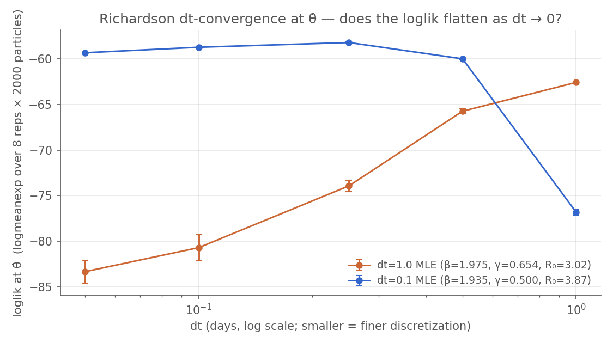

```{python}
#| label: setup
#| echo: false
#| output: false
import sys
from pathlib import Path
import polars as pl
import matplotlib.pyplot as plt
import matplotlib as mpl

# Import shared book-level helpers from <book root>/_lib/
sys.path.insert(0, str(Path("/Users/vsb/projects/work/camdl-book")))
from _lib.cli import run_cli, fit_clean

# Reader-faithfulness: clear stale fit dirs so each render lands one
# fit per config and the in-page `glob('<stem>-*').next()` selectors
# resolve unambiguously. Cheap; the actual fits below are content-cached
# by camdl, so this only forces a re-fit when the fit config or model
# file genuinely changed.
fit_clean(
    "fits/poisson_fixed_ic.toml",
    "fits/poisson_fixed_ic_dt01.toml",
    "fits/poisson_fixed_ic_synth.toml",
    "fits/poisson_fixed_ic_synth_dt1.toml",
)

GREY = "#555555"
mpl.rcParams.update({
    "figure.dpi": 150, "font.size": 10,
    "axes.edgecolor": GREY, "axes.labelcolor": GREY,
    "xtick.color": GREY, "ytick.color": GREY, "text.color": GREY,
    "axes.spines.top": False, "axes.spines.right": False,
})
```

In the [previous chapters](../experiments.qmd) we built a model, explored its
uncertainty, and tested its behaviour under different scenarios. Now we turn to
the central question: **how can we estimate the model's parameters we're
uncertain about from real data?** As we'll see, usually this question comes
with another one: **how well are the data able to fully constrain the model's
parameters?**

This chapter introduces `camdl fit`, the inference pipeline that finds
parameter values consistent with observed data. We fit an SIR model to the 1978
boarding school influenza outbreak and discover how much 14 daily observations
can — and can't — tell us about the underlying epidemic. This chapter uses the
likelihood-based **iterated filtering (IF2)** ([Ionides et al.,
2015](https://doi.org/10.1073/pnas.1410597112)), the same algorithm as pomp's
`mif2()` ([King, Nguyen & Ionides,
2016](https://doi.org/10.18637/jss.v069.i12)).

A compartmental model has *latent states* — the true number of susceptible,
infectious, and recovered individuals at each time — that we never observe
directly. We see noisy, incomplete proxies: daily bed counts. To find the
parameters that best explain the data we need the likelihood $L(\theta \mid
y_{1:T})$, an integral over *all possible* latent trajectories that is
generally intractable for stochastic compartmental models. The **particle
filter** approximates it; **iterated filtering** perturbs the parameters across
particles, runs the PF, and cools the perturbations across iterations. This is
a bit like simulated annealing on an approximate likelihood surface.

## Validating the Pipeline with Synthetic Data Recovery

Before fitting real data we should confirm the pipeline works *at all*.
Simulate a dataset from chosen "truth" parameters, fit with the same IF2
procedure, check that we recover the truth. If the pipeline can't recover
parameters it generated, it can't be trusted on data it didn't.

First, let's come up with some plausible pandemic-flu-in-school-children
ballpark parameters. Using what we know from prior publications, we might pick
something like:

| parameter | value     | rationale                                                                                                             |
|-----------|-----------|-----------------------------------------------------------------------------------------------------------------------|
| β         | 1.20 /day | transmission rate per infective                                                                                       |
| γ         | 0.33 /day | mean infectious period ≈ 3 days                                                                                       |
| I(0)      | 5         | distinct from the real-fit I(0) = 3 from the BMJ source — recovery on synthetic must not match real-fit configuration |
| N         | 763       | known school size                                                                                                     |
| R₀        | β/γ ≈ 3.6 | flu-like, distinct from real ≈ 3                                                                                      |


We'll store these parameters in a TOML file, so the simulate call below and
every fit that references the synthetic "truth" all read from one place. Here's
`fits/truth.toml`:

```{python}
#| echo: false
#| label: truth-toml
run_cli(["cat", "fits/truth.toml"], echo="fits/truth.toml", collapse=False)
```

Now feed those parameters to **the same model file we're about to fit** —
`boarding_school_sir.camdl`. Not a "synthetic" variant with a different
observation schedule or a wider window. A synthetic-recovery check is best
engineered if the data-generating model and the inference model are *identical*
`.camdl` files; the moment you tweak the observation cadence "just for the
synthetic run" you're validating a slightly different model than the one you
care about. The parameters come in separately, through `truth.toml` — that's
the only thing that changes between "generate data" and "fit data".

```{python}
#| echo: false
#| label: gen-synth
run_cli(
    "camdl simulate models/boarding_school_sir.camdl "
    "--params fits/truth.toml "
    "--backend chain_binomial --dt 0.1 "
    "--seed 17 --replicates 1 "
    "--obs data/synthetic.tsv",
    echo='camdl simulate models/boarding_school_sir.camdl --params fits/truth.toml --backend chain_binomial --dt 0.1 --seed 17 --obs data/synthetic.tsv',
)
```

One detail in that command worth flagging: `--dt 0.1`. The integrator
step `dt` turns out to matter — we'll dig into exactly why below. For
now, take it on faith that at `dt = 0.1` the chain-binomial process is a
faithful discretization of the SIR (the per-step recovery probability is
`1 − exp(−γ·dt) ≈ 0.03` — tiny), so the synthetic data is, to a good
approximation, a draw from the model we think we're studying. The model
observes "in bed" daily for 14 days, the same window as the real 1978
outbreak.

```{python}
#| label: fig-synth
#| fig-cap: "Synthetic outbreak at truth (β = 1.20, γ = 0.33), generated from boarding_school_sir.camdl — the same model the fit uses (seed 17, dt = 0.1). Peaks around day 7-8 (~270 boys), still declining at the day-14 cutoff. The real outbreak peaks earlier; recovering (1.20, 0.33) here means IF2 found the synthetic basin, not the real-data one."
synth = pl.read_csv("data/synthetic.tsv", separator="\t")
fig, ax = plt.subplots(figsize=(7, 3.2))
ax.plot(synth["time"], synth["in_bed"], color="#3366cc",
        marker="o", linewidth=1.4)
ax.fill_between(synth["time"], 0, synth["in_bed"], color="#3366cc", alpha=0.10)
ax.set_xlabel("Day"); ax.set_ylabel("Boys in bed")
ax.set_title("Synthetic outbreak (β = 1.20, γ = 0.33; seed 17)")
fig.tight_layout()
```

## A word on `dt = 0.1`

That `--dt 0.1` in the `simulate` command isn't arbitrary, and it's
not just numerical precision. The integrator step `dt` is **part of
the statistical model** — change it and you've changed the stochastic
process the chain-binomial backend realizes (and the likelihood it
computes), not just how finely it's resolved. For a fast outbreak
like this one the leap condition `r_max·dt ≲ 0.1` puts the faithful
step at `dt ≤ ~0.25`; `dt = 0.1` is comfortably inside that, and the
often-reached-for `dt = 1.0` is ~4× too coarse — coarse enough to
bend the dynamics and bias the fit, as we'll see below. The full
story — why `dt` is a model commitment rather than a tuning knob, how
to choose it (the leap condition, trajectory and likelihood ladders),
and the post-fit Richardson check that verifies the choice after
every fit — is its own chapter: [The Integrator
Step](../integrator-step.qmd). This chapter assumes it. We generate
the synthetic data at `dt = 0.1` for the same reason we'll fit at
`dt = 0.1`: it's the step that faithfully approximates the SIR we
mean to study.

## Recovering the truth — at `dt = 0.1`

With the faithful step chosen, fit the synthetic dataset back with the
same IF2 budget the real fit will use — 48 scout chains × 2000
particles × 250 iterations, then 12 refine chains × 4000 particles ×
400 iterations:

```{python}
#| echo: false
#| label: fit-synth
run_cli(
    "camdl fit run fits/poisson_fixed_ic_synth.toml --seed 30 "
    '--label "synth recovery same model dt 0.1" --progress plain',
    echo=('camdl fit run fits/poisson_fixed_ic_synth.toml --seed 30 '
          '--label "synth recovery same model dt 0.1" --progress plain'),
)
```

camdl's content-addressable cache means this runs once on first render
and is essentially instant on every subsequent render — the fit's
inputs (model hash, data hash, config hash, seed) determine the output
directory, so re-rendering reads from cache rather than re-fitting.

### Reading camdl's diagnostic output

```{python}
#| echo: false
#| label: summary-synth
fit_dir = next(Path("results/fits").glob("poisson_fixed_ic_synth-*/real/fit_30"))
run_cli(
    f"camdl fit summary {fit_dir} --no-color",
    echo=f"camdl fit summary {fit_dir}",
    max_lines=60, collapse=False,
)
```

`camdl fit summary` prints a fixed set of blocks. The first time
through, here's how to read each one. (The machinery behind several of
these — the particle filter, the log-likelihood estimate, effective
sample size — is the subject of the [inference chapter on
likelihood](../../inference/likelihood.qmd); IF2 itself is in [the
algorithms chapter](../../inference/algorithms.qmd). This is the
operator's-eye view.)

**The MLE and its likelihood.** `best loglik (loglik-eval)` is the
headline likelihood: each IF2 chain's winning parameter vector is
*re-scored* after the fit at a high particle count (4000 particles × 8
replicates, combined by `logmeanexp`), and this is the best of those
re-scores. The `parameter estimates` block is that winning chain's θ̂.
Re-scoring matters because IF2's *running* loglik during optimization
is a low-particle estimate biased by the perturbations it injects; the
post-fit re-score is the clean number.

**The compound scout-convergence gate** — two legs, *both* must pass.

*Leg 1 — Â (chain-agreement).* This is the Gelman–Rubin
potential-scale-reduction statistic — between-chain variance over
within-chain variance of a scalar — but computed on something an MCMC
run doesn't have: IF2's per-iteration parameter-*mean* trajectory
across the independent optimizer chains. The arithmetic is identical to
R-hat; the *interpretation* is not. R-hat asks "has this one Markov
chain mixed over the posterior?" Â asks "did these independent
stochastic optimizers all climb to the same place?" Importing R-hat's
reflexes — "above 1.01, keep sampling" — would be the wrong mental
model, so camdl gives it a different name (`chain_agreement` in the
TOML, `Â` in the summary) to keep the two apart. (camdl *does* report
`rhat`, by that name — for its PGAS / PMMH posterior samplers, where
the chains genuinely are posterior draws and the MCMC reading applies.)
Bands:

| Â | reading |
|---|---|
| `< 1.05` | converged on this leg ✓ |
| `1.05 – 1.10` | marginal `~` — report it, tighten bounds or add iterations, rerun |
| `≥ 1.10` | not converged ✗ — do **not** interpret θ̂ |

*Leg 2 — decibans spread (Δ_dB).* Â passing tells you the chains
*agree*; it does not tell you they agreed on a *good* place. So the
gate also looks at the chain-by-chain re-scored log-likelihoods and
computes `Δ_dB = (max − min) × 10/ln 10` — the spread between the best
and worst chain's basin, in decibans — against an SE-aware threshold
(default 30 dB, with a floor that lifts automatically if the particle
filter is noisy). All thirty-six chains of a measles fit can have
`Â < 1.05` on every parameter while sitting in basins thousands of dB
apart; the decibans leg is the catch for exactly that. Â: "did they
agree on *where*?" Δ_dB: "was *where-they-agreed* any good?" Fail
either and `overall` is ✗.

**Per-chain loglik-eval.** The re-scored loglik ± SE for every chain;
`← selected` marks the one whose θ̂ becomes the reported MLE. The
spread down this column is what the decibans leg summarizes — a tight
cluster is healthy; one or two chains far below the rest is a
multimodal-surface flag.

**ESS at θ̂.** The particle filter's effective sample size at the MLE
— `min` over observation steps and `mean`. (ESS is *the* primary
particle-filter diagnostic; see the [ESS section of
inference/likelihood](../../inference/likelihood.qmd) for what it
measures and why it collapses.) A single-digit `min` at the
most informative observation — the rising-limb crunch, here — is common
and tolerable. A `min` near 1 *everywhere* means the loglik estimate at
θ̂ is unreliable and you should raise the particle count before
believing the number.

**dt-convergence at θ̂ (Richardson).** As above — the loglik at θ̂
re-evaluated at `dt`, `dt/2`, `dt/4`, with a two-legged plateau
criterion. `PASS` means the MLE survived finer discretization; `FAIL`
means it didn't, and the verdict tells you the largest `dt` to retry
at.

**provenance.** `final_params.toml ↔ mle_params.toml ↔ fit_state.toml`
should all agree. A mismatch means the on-disk artifacts got out of
sync (a bug, or a stray hand-edit) — don't trust the reported numbers
until it's resolved.

| block | measures | good | if bad |
|---|---|---|---|
| `best loglik` (loglik-eval) | the MLE's likelihood, re-scored at high particle count | compare across models / to a PPC | — |
| per-parameter `Â` | do the independent IF2 chains agree on this parameter's optimum? | `< 1.05` | `1.05–1.10`: tighten + rerun. `≥ 1.10`: don't interpret θ̂ |
| decibans leg `Δ_dB` | how far apart are the chain-level basins, in likelihood units? | `< 30 dB` (SE-aware floor) | widen bounds toward the best basin / more chains / more iterations / informed `start` values |
| compound gate `overall` | both legs pass? | `✓` | `✗` — root-cause the failing leg; never `--allow-nonconverged-scout` |
| per-chain loglik-eval | the basins, chain by chain | tight cluster | outlier chains far below → multimodal surface |
| `ESS at θ̂` (min / mean) | particle-filter effective sample size at the MLE | `min` ≳ a few; `mean` ≫ 1 | `min ≈ 1` everywhere → loglik unreliable; raise particle count |
| dt-convergence verdict | does the loglik at θ̂ survive finer `dt`? | `PASS` | `FAIL` → MLE is discretization-dependent; refit at the suggested `dt` |
| provenance | do the on-disk param files agree? | all `✓` | mismatch → artifacts out of sync; resolve before trusting numbers |

Now read this synth-recovery fit through that lens.
**Recovery within ~5% on β, ~3% on γ.** The pipeline lands at
(β ≈ 1.14, γ ≈ 0.32), R₀̂ ≈ 3.5 — close to the truth (1.20, 0.33,
R₀ = 3.64), and *not* in the real-data basin (β ≈ 2, γ ≈ 0.66) we'll
hit next. Both gate legs pass: refine  ≤ 1.04 on every parameter
(Â leg ✓), and the chain-level loglik-eval spread is a fraction of a
decibel (decibans leg ✓, 30 dB threshold with an SE-aware floor).
Recovery is non-circular — the data, not the optimiser's biases,
determined where IF2 converged.

The β / γ asymmetry — γ tighter than β — is a structural property of
this data, not a fitting artefact. γ controls the falling limb's slope,
which the data pins tightly; β controls the rising limb where the
chain-binomial process has more trajectory-level variance. Expect the
same asymmetry on the real-data fit.

And notice the last block of that summary: the post-fit **Richardson
dt-convergence check** passes too — `|Δ_leg1| ≈ 0.1, |Δ_leg2| ≈ 0.1
nats`, well under the threshold. The loglik is flat across a halving
ladder at θ̂. That's no accident: we chose `dt = 0.1` precisely
*because* the diagnostics above said it was faithful. The recovery
loop just inherited that choice. Which raises the obvious question —
what if we hadn't?

### What if we'd reached for the default `dt = 1`?

Same synthetic data, same IF2 budget, same wide bounds — the only
change is `config.dt = 0.1 → 1.0`:

```{.toml filename="fits/poisson_fixed_ic_synth_dt1.toml"}

```

```{python}
#| echo: false
#| label: fit-synth-dt1
run_cli(
    "camdl fit run fits/poisson_fixed_ic_synth_dt1.toml --seed 30 "
    '--label "synth dt 1.0 default" --progress plain',
    echo=('camdl fit run fits/poisson_fixed_ic_synth_dt1.toml --seed 30 '
          '--label "synth dt 1.0 default" --progress plain'),
)
```

```{python}
#| echo: false
#| label: summary-synth-dt1
synth_dt1_dir = next(Path("results/fits").glob("poisson_fixed_ic_synth_dt1-*/real/fit_30"))
run_cli(
    f"camdl fit summary {synth_dt1_dir} --no-color --stage refine",
    echo=f"camdl fit summary {synth_dt1_dir} --stage refine",
    max_lines=40, collapse=False,
)
```

Two things to read off. **The bias shows up in the estimate.** γ̂
comes out ≈ 0.39 — about 18 % above the truth `γ = 0.33` — while β̂ ≈
1.19 is essentially spot on. That asymmetry is exactly the
saturation effect: at `dt = 1.0` the per-step recovery probability
under-counts, so IF2 compensates by inflating the *nominal* recovery
rate. You recover "the parameters that make a `dt = 1.0` simulation
match `dt = 0.1`-generated data" — and those aren't the parameters
that generated it.

**And the Richardson check is teetering.** On the refine MLE the
halving leg lands at `|Δ_leg1| ≈ 1.8 nats` against the 2-nat
threshold — a pass, but by a hair; the scout stage's MLE actually
trips it (`|Δ_leg1| ≈ 2.9 nats`, a 1.5× failure). Fourteen daily
observations of a `γ = 0.33` outbreak just isn't quite enough signal
to push the post-fit verdict over the line. It's a warning shot, not
a klaxon. On the real outbreak next — where the fitted `γ̂` comes out
roughly twice as fast, so `γ̂·dt` is twice as coarse — the warning
shot becomes a clean failure.

The lesson the synthetic case already teaches: **synthetic recovery
can't tell you whether your `dt` is faithful**, because the simulator
and the inference loop always share it. You either choose `dt` for
fidelity up front (the diagnostics above) and let the recovery loop
inherit a good choice, or you reach for a default, get a biased
estimate, and hope the post-fit dt-check is sharp enough to catch it.
On real data the world picks the data-generating process, not you —
which is why the dt-check exists.

## Real-data fit

With the pipeline validated and the integrator step settled —
`dt = 0.1`, faithful by the diagnostics above — we fit the actual
1978 outbreak. The data is 14 daily counts of boys confined to bed in
a closed population of 763: a textbook closed-system SIR fit, because
the outbreak plays out fully inside the observation window.

```{python}
#| label: fig-obs
#| fig-cap: "1978 English boarding-school influenza outbreak: daily counts of boys confined to bed (BMJ 1978; N = 763 students). Peak of 298 on day 5, declining to single digits by day 14."
obs = pl.read_csv("data/in_bed.tsv", separator="\t")
fig, ax = plt.subplots(figsize=(7, 3.2))
ax.plot(obs["time"], obs["in_bed"], color="black",
        marker="o", linewidth=1.4)
ax.fill_between(obs["time"], 0, obs["in_bed"], color="black", alpha=0.08)
ax.set_xlabel("Day"); ax.set_ylabel("Boys in bed")
ax.set_title("Observed outbreak")
fig.tight_layout()
```

The fit configuration — same IF2 budget as the synthetic recovery,
plain SIR + Poisson observation, fixed N = 763 and I(0) = 3 (the BMJ
source: three boys in the infirmary on day 0), `dt = 0.1`, estimating
only β and γ over wide flu-plausible bounds:

```{.toml filename="fits/poisson_fixed_ic_dt01.toml"}

```

```{python}
#| echo: false
#| label: fit-real-dt01
run_cli(
    "camdl fit run fits/poisson_fixed_ic_dt01.toml --seed 28 "
    '--label "Poisson, fixed IC, dt 0.1" --progress plain',
    echo=('camdl fit run fits/poisson_fixed_ic_dt01.toml --seed 28 '
          '--label "Poisson, fixed IC, dt 0.1" --progress plain'),
)
```

```{python}
#| echo: false
#| label: summary-real-dt01
real_dir = next(Path("results/fits").glob("poisson_fixed_ic_dt01-*/real/fit_28"))
run_cli(
    f"camdl fit summary {real_dir} --no-color --stage refine",
    echo=f"camdl fit summary {real_dir} --stage refine",
    max_lines=40, collapse=False,
)
```

**The boarding-school MLE.** β̂ ≈ 1.94/day, γ̂ ≈ 0.50/day, giving
$R_0 = \hat\beta / \hat\gamma \approx 3.87$ and a mean infectious
period of $1/\hat\gamma \approx 2.0$ days. The compound gate passes
both legs (chain-agreement  under the 1.05 band on both parameters;
inter-chain loglik-eval spread a fraction of a decibel against the
30 dB threshold — read it through [the walkthrough
above](#reading-camdls-diagnostic-output) if any block is unfamiliar).
And — the payoff of belabouring `dt` — the post-fit Richardson check
**passes**: `|Δ_leg1| = 0.45, |Δ_leg2| = 0.64` nats against τ = 2.0,
so the loglik at this θ̂ is flat across `dt ∈ {0.05, 0.1, 0.25}` and
refining the integrator further wouldn't move it. This is an MLE of
the underlying continuous-time process, not of an arbitrary
discretization. R₀ ≈ 3.87 sits comfortably in [Anderson & May
(1991)'s textbook range of 3.5–4 for influenza in a school
population](https://doi.org/10.1093/oso/9780198545996.001.0001), and
a 2-day mean infectious period is biologically plausible for flu.

A posterior-predictive check confirms the fitted model can generate
outbreaks like the observed one. We draw 200 forward replicates from
the chain-binomial backend at θ̂ — each emitting its own Poisson-noisy
`in_bed` observations via `--obs` — and compare the 5–95 % envelope
(which folds in both process uncertainty, the chain-binomial
trajectory variance, and observation uncertainty, the Poisson noise on
top of the latent prevalence) to the data:

```{python}
#| label: ppc-sim-dt01
from _lib.sim import run_simulate
import numpy as np
obs_days = obs["time"].to_numpy()
dt01_mle = real_dir / "refine/mle_params.toml"
_traj_dt01, ppc_obs_dt01 = run_simulate(
    "models/boarding_school_sir.camdl", str(dt01_mle),
    seed=28, replicates=200,
    backend="chain_binomial", dt=0.1, scenario="baseline",
    obs=True,
)
q05_01, q50_01, q95_01 = [], [], []
for t in obs_days:
    vals = ppc_obs_dt01.filter(pl.col("time") == t)["in_bed"].to_numpy()
    a, b, c = np.quantile(vals, [0.05, 0.5, 0.95])
    q05_01.append(a); q50_01.append(b); q95_01.append(c)
n_obs = obs.height
n_miss_01 = sum(1 for y, lo, hi in zip(obs["in_bed"], q05_01, q95_01) if not (lo <= y <= hi))
expected = 0.10 * n_obs
print(f"N = {n_obs} observations, 90% envelope.")
print(f"Expected misses under nominal coverage: {expected:.1f} (±{np.sqrt(n_obs*0.1*0.9):.1f})")
print(f"Observed misses: {n_miss_01}")
```

```{python}
#| label: fig-ppc-dt01
#| fig-cap: "Posterior-predictive check at the dt = 0.1 MLE. Blue band: 5–95% envelope of `in_bed` across 200 chain-binomial forward replicates with Poisson observation noise; blue line: median; black dots: 1978 BMJ observations. The envelope tracks the data — 1 of 14 observations outside the 90% envelope against an expected 1.4 ± 1.1. Process and observation uncertainty together comfortably cover the outbreak."
fig, ax = plt.subplots(figsize=(7, 3.5))
ax.fill_between(obs_days, q05_01, q95_01, color="#3366cc", alpha=0.20,
                label="5–95% envelope")
ax.plot(obs_days, q50_01, color="#3366cc", linewidth=1.3, label="median")
ax.plot(obs["time"], obs["in_bed"], "o", color="black", markersize=5,
        label="data", zorder=5)
ax.set_xlabel("Day"); ax.set_ylabel("Boys in bed")
ax.legend(frameon=False, loc="upper right")
fig.tight_layout()
```

**Inside nominal coverage.** One observation of 14 outside the 90 %
envelope where 1.4 ± 1.1 is expected — the fitted model's process and
observation noise together cover the data. That's the headline result:
a calibrated SIR + Poisson + fixed-IC fit at `dt = 0.1`, R₀ ≈ 3.87.

The rest of this section is a footnote: what you'd have gotten if
you'd skipped [The Integrator Step](../integrator-step.qmd) and
reached for the obvious default `dt = 1`.

### The default `dt = 1`, for the record

The config is identical to the headline `dt = 0.1` one except for
`config.dt`:

```{.toml filename="fits/poisson_fixed_ic.toml"}

```

```{python}
#| echo: false
#| label: fit-real
run_cli(
    "camdl fit run fits/poisson_fixed_ic.toml --seed 28 "
    '--label "Poisson, fixed IC, dt 1.0" --progress plain',
    echo=('camdl fit run fits/poisson_fixed_ic.toml --seed 28 '
          '--label "Poisson, fixed IC, dt 1.0" --progress plain'),
)
```

```{python}
#| echo: false
#| label: summary-real
real_dt1_dir = next(Path("results/fits").glob("poisson_fixed_ic-*/real/fit_28"))
run_cli(
    f"camdl fit summary {real_dt1_dir} --no-color --stage refine",
    echo=f"camdl fit summary {real_dt1_dir} --stage refine",
    max_lines=40, collapse=False,
)
```

You'd land at β̂ ≈ 1.99/day, γ̂ ≈ 0.66/day — R₀ ≈ 3.0, a 1.5-day
infectious period — and the compound gate would pass, both legs
decisively, just like the headline fit. But the **post-fit Richardson
check fails**: halving `dt` drops the loglik 4.19 nats (leg-1, 2.1×τ);
two halvings drop it 13.32 nats (leg-2, 6.7×τ); the threshold here is
$\tau = \max(2,\,4\sigma_{\max}) = 2$ nats, the chain-binomial floor
($\sigma_{\max} = 0.28$ nats keeps the SE-aware term inactive). The
synthetic `dt = 1` detour foreshadowed exactly this — there the
Richardson check teetered on its threshold; here, on the faster real
outbreak (`γ̂·dt ≈ 0.66` against `≈ 0.39` on synthetic), it fails
outright. The full ladder:



*Reading.* Orange: the `dt = 1.0` MLE re-scored at finer `dt` — it
keeps falling 20+ nats as `dt → 0`, because that θ̂ is the maximum of
$L(\theta; y, M_{dt=1.0})$ and the finer process models score it
badly. Blue: the `dt = 0.1` MLE from above, flat across `dt ≤ 0.5` —
discretization-stable in the regime that matters, and only falling at
the coarsest point. Same model name, same parameter names; different
processes. (The `dt = 1.0` fit's posterior-predictive check tells the
same story from the data side — peak shifted ~1.5 days late,
rising-limb undershoot, thick tail, 5 of 14 observations outside the
90 % envelope — but the Richardson verdict already flagged it, before
any forward simulation. We don't need the data envelope to know the
fit is wrong; the verdict is preventative.)

|  | dt = 1.0 fit | dt = 0.1 fit (headline) |
|---|---:|---:|
| β̂ | 1.991 | 1.935 |
| γ̂ | 0.660 | 0.500 |
| R₀ = β/γ | 3.02 | **3.87** |
| mean infectious period 1/γ | 1.5 days | **2.0 days** |
| best loglik | −62.6 | −58.7 |
| dt-convergence verdict | FAIL (leg-1 2.1×, leg-2 6.7×) | PASS |

The `dt = 1.0` "MLE" isn't wrong arithmetic — it's the right maximum
of the wrong model. Refit at the faithful `dt = 0.1` (above) and R₀
moves from 3.0 to 3.87: the difference between under-stating the
outbreak's intensity by ~20 % and getting it right. And note what the
compound gate did and didn't tell you here — it certified that IF2
converged, on a model that wasn't the one you meant to fit.
**Identification gate ≠ model adequacy.** Nor — and this is the part
worth promoting to a rule — would the synthetic recovery from the top
of the chapter have caught it.

::: {.callout-warning}
## Synth recovery is necessary, not sufficient

A successful synthetic-data recovery certifies the optimiser, not
the model's contact with reality. The simulator and the inference
loop share every modelling commitment — including the discretization
step `dt` — so any bias from those commitments cancels (or nearly
cancels) in the recovery metric. To validate the *model*, you need
either (a) the post-fit Richardson dt-check
([camdl#52](https://github.com/vsbuffalo/camdl/issues/52)), which
tests whether the MLE survives finer discretization, or (b) a
posterior-predictive check on real data, which tests whether
trajectories from the fitted model resemble what the world produced.
Don't treat synth recovery as a stand-in for either.
:::

## `dt`, in one line

The `dt` half of this fit's story is the standalone case the
[Integrator Step](../integrator-step.qmd) chapter makes in full:
`dt` is a model commitment, not a tuning knob; choose it for fidelity
(the leap condition gives $dt \le 1/(5\,r_{\max}) \approx 0.25$ here,
so `dt = 0.1` is safe), find the MLE of *that* model, and let the
post-fit Richardson check verify the choice. On this fit it did:
`dt = 0.1` passes, `dt = 1.0` fails by 2–7×. The reflex worth
carrying forward: **read the dt-convergence verdict next to the
chain-agreement  and the decibans spread, every time — don't
interpret $\hat\theta$ until all three pass.**

## What's next

With the fit now calibrated, the next chapters become honest extensions
rather than bug-fixes:

- **Model comparison** ([next chapter](model_comparison.qmd)) asks:
  given the simple SIR + Poisson + fixed-IC model is calibrated at
  `dt = 0.1`, does NegBin observation or process noise on β buy
  anything further, or is the simple model the right answer? Less
  "fix the bug," more "what's the principled extension?"
- **Priors and initial conditions** (forthcoming) asks whether
  relaxing $I(0) = 3$ changes anything. The PPC at `dt = 0.1`
  already passes — this is now a *robustness* check, not a
  remediation. The data alone cannot identify
  $(\beta, \gamma, I(0), R(0))$ jointly; informed priors on $R(0)$
  (e.g. Avilov 2024's seroprevalence ≈ 30 %) can rescue inference.
  Worth doing as a sensitivity exercise, not because the headline
  fit needs rescuing.
