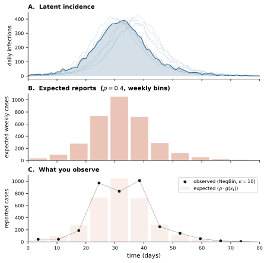
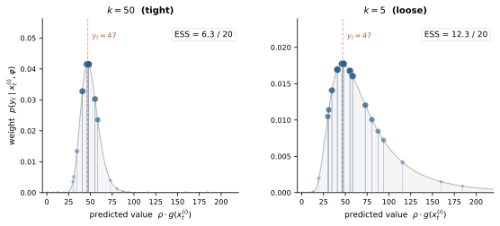

How the particle filter, IF2, PGAS, and NUTS work, what the diagnostics mean,
and how the fitting pipeline connects them.

---

## 1. The likelihood you want but can't have

A compartmental model defines a stochastic process over a **latent state** $x_t$
— the compartment populations (S, E, I, R) evolving through time. You never
observe this state directly. What you observe is a noisy, incomplete projection:
weekly case reports, seroprevalence surveys, death counts.

The goal of inference is to recover model parameters from these observations.
This means evaluating the **marginal likelihood** — the probability of the
observed data $y_{1:T}$ given parameters, integrated over all possible latent
trajectories:

$$p(y_{1:T} \mid \theta, \varphi) = \int p(y_{1:T}, x_{0:T} \mid \theta, \varphi) \, dx_{0:T}$$

This integral is over every possible path the epidemic could have taken. For a
model with thousands of individuals tracked over hundreds of observation times,
it is intractable.

But the **integrand** — the joint density of data and trajectory — factors into
pieces you can reason about:

$$p(y_{1:T}, x_{0:T} \mid \theta, \varphi) = \underbrace{\prod_{t=1}^{T} p(y_t \mid x_t, \varphi)}_{\text{observation likelihood}} \cdot \underbrace{\prod_{t=1}^{T} p(x_t \mid x_{t-1}, \theta)}_{\text{transition likelihood}} \cdot \; p(x_0 \mid \theta)$$

Both factors are likelihoods — conditional probabilities viewed as functions of
parameters. Together they form the **complete-data likelihood**: the probability
of everything you know (data + trajectory) given parameters. The marginal
likelihood integrates the transition likelihood over trajectories; the
complete-data likelihood doesn't.

Two kinds of parameters appear:

- **$\theta$** — dynamics parameters: transmission rate $\beta$, recovery rate
  $\gamma$, overdispersion $\sigma^2$, initial conditions. These control how the
  epidemic unfolds.
- **$\varphi$** — observation parameters: reporting probability $\rho$,
  dispersion $k$, detection probability. These control how the data relates to
  the latent trajectory.

This factorization is the organizing principle of everything that follows. The
observation likelihood depends on $\varphi$ only. The transition likelihood
depends on $\theta$ only. Every inference algorithm is a strategy for handling
these two pieces.

::: {.callout-note}
## Log-likelihoods are measured in nats

Throughout this book, log-likelihoods use the natural logarithm
(base $e$), so the unit is the **nat** — the natural unit of
information. A difference of 1 nat between two models means one
assigns $e \approx 2.72$ times higher probability to the data. A
difference of 3 nats is a factor of ~20; 5 nats is ~150×.

The nat scale is universal across all likelihood-based comparisons
in camdl: IF2 log-likelihoods, PGAS posterior densities, elpd in
model comparison, and the E_T e-value column (`exp(Δelpd)` converts
nats back to a probability ratio). When you see "the log-likelihood
improved by 2 nats," that means the better model assigns ~7× higher
probability to the observed data. When the improvement is 0.5 nats,
it's only ~1.6× — probably noise.

(Information theorists use bits (log₂); Bayesians and physicists
use nats (ln). The choice is a constant factor: 1 nat ≈ 1.44 bits.
camdl uses nats because $\ln$ is what falls out of the math
naturally.)
:::

---

## 2. Observation likelihood — the piece you can always evaluate

Given a trajectory $x_{0:T}$ (simulated or sampled), the observation model
computes the probability of the data at each observation time. This is cheap,
closed-form, and shared by every algorithm in camdl.

### How it works

At each observation time $t$, the model projects the latent state into an
observable quantity — typically cumulative flows (incidence) or current
compartment counts (prevalence). The observation likelihood then scores the
observed data against this projection:

$$p(y_t \mid x_t, \varphi) = f(y_t \mid g(x_t), \varphi)$$

where $g(x_t)$ is the projection (e.g., total infection flows since last
observation) and $f$ is the likelihood family.

### Example: negative binomial case counts

The most common observation model in camdl. Weekly reported cases are a fraction
$\rho$ of true incidence, with overdispersion $k$:

$$y_t \sim \text{NegBin}\bigl(\text{mean} = \rho \cdot g(x_t),\; r = k\bigr)$$

where $g(x_t)$ sums the `infection` flow accumulator over the observation
interval. The log-density:

$$\log p(y_t \mid x_t, \varphi) = \log \Gamma(y_t + k) - \log \Gamma(k) - \log(y_t!) + k \log\!\frac{k}{\mu + k} + y_t \log\!\frac{\mu}{\mu + k}$$

with $\mu = \rho \cdot g(x_t)$ and $\varphi = (\rho, k)$.

This is one function evaluation per observation time — bounded, smooth,
differentiable in $\varphi$.

### Why this matters

When ESS collapses in the particle filter, it's because the observation
likelihood is sharply peaked. The data says "roughly 47 cases this week" and
most simulated trajectories produced 0 or 500. More particles help (better
coverage of the likely region). Looser observation models help (wider $k$
spreads the weight across more particles). Understanding the observation
likelihood as a weighting function — not just a statistical formality — is the
key diagnostic intuition.

---

## 3. Transition likelihood — the piece that separates the algorithms

The transition likelihood $p(x_t \mid x_{t-1}, \theta)$ is the probability of
the specific compartment changes that occurred between time steps, viewed as a
function of $\theta$. Whether you can _evaluate_ this density pointwise (not
just simulate from it) determines which inference algorithms are available.

### Chain-binomial: closed-form density available

In the chain-binomial (Euler-multinomial) backend, one time step draws events
from a product of binomials. For each source group $g$ with source count $n_g$
and exit probability $p_g$:

$$p(\text{flows}_g \mid x_{t-1}, \theta) = \text{Multinomial}(\text{flows}_g \mid n_g, p_g)$$

where $p_g = 1 - \exp(-\text{rate}_g \cdot dt)$ and rates are computed from the
propensity expressions.

With overdispersion ($\sigma^2 > 0$), the per-capita rate is Gamma-distributed:

$$\gamma_g \sim \text{Gamma}\!\left(\frac{dt}{\sigma^2},\; \frac{\sigma^2}{dt}\right)$$

and the full transition likelihood becomes:

$$p(x_t \mid x_{t-1}, \theta) = \prod_g \text{Multinomial}(\text{flows}_g) \cdot \prod_g \text{Gamma}(\gamma_g)$$

Both terms are closed-form. This is what makes PGAS possible for chain-binomial
models: you can evaluate the transition likelihood pointwise, not just simulate
from it.

### Gillespie / tau-leap: closed-form density not available

For Gillespie SSA, evaluating $p(x_t \mid x_{t-1}, \theta)$ involves the full
sequence of exponential waiting times and event selections — available in
principle but computationally expensive for a discretized observation schedule.
For tau-leap, the Poisson approximation makes pointwise evaluation feasible but
less commonly used in practice.

The key consequence: **IF2 and PMMH work with any backend** (they only need
simulation). **PGAS requires chain-binomial** (it needs to evaluate the
transition likelihood). This isn't a limitation of the implementation — it's a
fundamental property of the algorithm.

### Why the Gamma term matters

The overdispersion Gamma factor $p(\gamma_g)$ is part of the transition
likelihood. If you evaluate it without the Gamma term, you're computing
$p(\text{flows} \mid \gamma, \theta)$ instead of
$p(\text{flows}, \gamma \mid \theta)$. The complete-data log-likelihood is
wrong, and its gradient (used by NUTS) is inconsistent with the value —
proposals drift, acceptance rates drop, chains don't converge.

This is not a theoretical concern. It's the root cause of real bugs. The Gamma
term is modest in magnitude (often a few log-units per substep) but the gradient
effect accumulates across hundreds of substeps.

### Choosing a backend

The backend determines both the simulation mechanics and which inference
algorithms are available. The choice matters more than it might seem —
each makes a different approximation.

::: {.callout-note collapse="true"}
## What is "chain-binomial" and how does it relate to Euler-multinomial?

The names reflect historical accident more than structural difference.
The **chain-binomial** model (Reed & Frost, taught at Johns Hopkins in
the 1920s–30s; published by Abbey 1952; systematized in Bailey 1975)
discretizes an epidemic into generations: at each step, $I_{t+1} \mid
S_t, I_t \sim \text{Binomial}(S_t, 1 - q^{I_t})$. "Chain" because
it's a Markov chain; "binomial" because each transition is a binomial
draw.

The **Euler-multinomial** (Bretó et al. 2009; He et al. 2010)
generalizes this to continuous-time models with competing exits — an $I$
individual can recover, die, or be reported — discretized at step size
$\Delta t$. The exits are multinomial rather than binomial, with
probabilities derived from the competing hazards: $p_j = (\lambda_j /
\lambda_{\text{tot}})(1 - e^{-\lambda_{\text{tot}} \Delta t})$.
Chain-binomial is the special case with one exit per compartment and
$\Delta t$ equal to one generation.

Both are finite-population stochastic models where each time step is a
joint draw of how many individuals move along which edge, conditional on
current compartment sizes. The transition kernel is a composition of
independent individual-level draws — which is why the density is
closed-form and why particle-filter-based inference works.

For readers with a population genetics background: the structure is the
same as a Wright-Fisher model with multiple allelic classes. Replace
"allele frequency" with "compartment fraction," replace "selection
coefficient" with "force of infection minus recovery," and the
transition kernel is the same multinomial-conditional-on-current-state
object. The identifiability geometry is similar too: in Wright-Fisher,
$N_e$ and selection $s$ are partially confounded from a single-locus
trajectory; in stochastic SIR, $R_0$ and reporting rate $\rho$ have the
same issue on a single outbreak — you observe $\rho R_0$-like
combinations cleanly but need additional structure to separate them.
Both are cases where a single realization of a finite-population Markov
chain under-determines the generator. The key biological difference is
the depletion-of-susceptibles nonlinearity: $S$ decreases monotonically
during an outbreak, making the drift strongly state-dependent in a way
neutral genetics doesn't see.
:::

::: {.callout-tip collapse="false"}
## Chain-binomial (Euler-multinomial) — the default for inference

**Use chain-binomial when you plan to fit the model.** It's the only
backend that provides a closed-form transition density, which unlocks
PGAS (the most efficient Bayesian algorithm for these models). It also
works with IF2 and PMMH.

The chain-binomial is a discrete-time scheme: at each step $dt$, rates
are converted to probabilities $p = 1 - \exp(-\text{rate} \cdot dt)$
and events are drawn from a multinomial. The multinomial correctly
handles **competing risks** — if compartment $I$ has both recovery and
death transitions, they compete for the same individuals, and their
combined exits can never exceed $I$. This is guaranteed by construction.

**Overdispersion** ($\sigma^2 > 0$) enters naturally: the per-capita
force of infection is scaled by a Gamma random variable before the
probability conversion. Both the multinomial and Gamma terms have
closed-form densities, so the full transition likelihood is evaluable.
This is what [He et al. (2010)](https://doi.org/10.1098/rsif.2009.0151)
used for London measles, and it remains the standard in pomp.
:::

::: {.callout-warning collapse="false"}
## Chain-binomial — watch out

**Discretization bias from large $dt$.** The chain-binomial assumes
rates are constant within each step. When compartment sizes change
substantially during $dt$ — for instance, $I$ doubling in one day
during exponential growth — the rate at the start of the step
doesn't represent the dynamics within it. The approximation error is
$O(dt)$ (first-order Euler).

**Rule of thumb:** $dt$ should be small enough that no compartment
changes by more than ~10% in a single step. For fast epidemics in small
populations (the boarding school at peak: $\Delta I / I \approx 50\%$
per day), use $dt = 0.5$ or smaller. For slower dynamics or large
populations, $dt = 1$ is usually fine.

**Jensen's inequality with overdispersion.** Because the Gamma noise
enters *before* the nonlinear $1 - \exp(\cdot)$ conversion, adding
mean-preserving noise to the rate slightly *reduces* the expected
infection probability (§ overdispersion in the
[experiments chapter](../guide/experiments.qmd)). This means parameters
estimated under an overdispersed model are not directly comparable to
parameters from a non-overdispersed model — the model structure and
parameters are entangled.

**Computational cost:** $O(G)$ per substep, where $G$ is the number
of source groups (transition clusters sharing a source compartment).
Much cheaper than Gillespie for large populations. The cost scales
with model structure, not with population size.
:::

::: {.callout-tip collapse="false"}
## Gillespie SSA — exact continuous-time simulation

**Use Gillespie when you need an exact stochastic simulation and don't
plan to run PGAS.**
([Gillespie, 1977](https://doi.org/10.1021/j100540a008))
Every event (each individual infection, each recovery) is simulated
at its exact time — no discretization error, no $dt$ to tune. The
result is the "ground truth" stochastic process. It works with IF2
and PMMH for inference.

Gillespie is the right choice for **small populations** where discrete
effects matter (a handful of initial infections, near-extinction
dynamics) and for **validation** — comparing Gillespie output against
chain-binomial at various $dt$ tells you whether your $dt$ is small
enough.
:::

::: {.callout-warning collapse="false"}
## Gillespie — watch out

**Cost scales with event count, not time span.** Each step simulates
one event. For a population of $N = 10{,}000$ with $R_0 = 3$, the
total number of events (infections + recoveries) is $\sim 20{,}000$.
For $N = 3.3$ million (London), it's $\sim 6$ million events per
simulation. At $dt = 0.5$, the chain-binomial handles the same
dynamics in ~$2T$ steps regardless of $N$.

**No closed-form transition density for discretized observations.**
Evaluating $p(x_t \mid x_{t-1}, \theta)$ for a Gillespie trajectory
between observation times requires tracking every intermediate event
— available in principle but not implemented in camdl. This rules out
PGAS. For Bayesian inference with Gillespie, use PMMH.

**Overkill for large populations.** When $N$ is large enough that the
law of large numbers smooths out individual-level randomness, the
exact event-by-event simulation adds precision that no observation
model can distinguish. The chain-binomial with $dt = 0.5$ produces
statistically indistinguishable results at a fraction of the cost.
:::

::: {.callout-tip collapse="false"}
## Tau-leap — fast approximate simulation

**Use tau-leap for rapid exploration**
([Cao, Gillespie & Petzold, 2006](https://doi.org/10.1063/1.2159468))
when you want speed over precision — prior predictive checks,
sensitivity sweeps, quick iterations on model structure. Each step
draws event counts from independent Poisson distributions,
approximating the Gillespie process at discrete time steps.

Tau-leap is typically the fastest backend, and it works with IF2 and
PMMH for inference.
:::

::: {.callout-warning collapse="false"}
## Tau-leap — watch out

**Independent Poisson draws don't respect competing risks.** Unlike the
chain-binomial's multinomial, tau-leap draws each transition
independently. If compartment $I$ has 50 individuals and two exits
(recovery, death) each with high probability, the independent Poisson
draws can produce $35 + 25 = 60$ total exits from 50 individuals.
camdl clamps negative compartments to zero, but this introduces bias —
the effective exit rate is lower than intended.

**This bias is worst at epidemic peaks** — exactly when compartments
are large, rates are high, and multiple transitions compete. For models
with a single exit per compartment (simple SIR where $I$ only has
recovery), tau-leap and chain-binomial are nearly equivalent. For
models with competing risks (SEIR with I→R and I→D, or overdispersed
infection alongside recovery), the chain-binomial is more faithful.

**No PGAS.** Like Gillespie, tau-leap doesn't provide a transition
density suitable for PGAS. Use chain-binomial if you want full
Bayesian inference.
:::

---

## 4. Three strategies for the intractable integral

Recall from above that the likelihood of the observed data $p(y_{1:T} \mid
\theta, \varphi)$ is intractable, since it's an integral over all possible
trajectories. There are three approaches to get around this: 

| Strategy                                | Algorithm       | What it computes                            | Needs transition likelihood? |
| --------------------------------------- | --------------- | ------------------------------------------- | ---------------------------- |
| Estimate the integral stochastically    | Particle filter | $\hat{p}(y \mid \theta, \varphi)$           | No                           |
| Maximize it                             | IF2             | $\arg\max_\theta p(y \mid \theta, \varphi)$ | No                           |
| Avoid it — work with the joint directly | PGAS            | $p(\theta, \varphi, x \mid y)$              | Yes                          |

IF2 and the particle filter only need the observation likelihood (§2) and the
ability to simulate forward. They never touch the transition likelihood. PGAS
uses both pieces — observation likelihood AND transition likelihood — to
evaluate the complete-data log-posterior directly, bypassing the intractable
integral entirely.

PMMH occupies a middle ground: it uses the particle filter's stochastic estimate
of the marginal likelihood as an MCMC acceptance ratio.

The choice between these strategies is the central decision of the fitting
workflow. The callouts below summarize the practical tradeoffs — when each
algorithm is the right tool, and what can go wrong.

::: {.callout-tip collapse="false"}
## IF2 — when to use

**Use IF2 when you want a point estimate (MLE) and work with any backend.**
IF2 is the right first step in almost every workflow: it's fast, requires only
forward simulation, and finds the parameter region where the model fits the data.
It scales to ~10–15 estimated parameters in standard settings
([King et al., 2016](https://doi.org/10.18637/jss.v069.i12)).

**Start here.** Run 8+ chains from dispersed starting points (the scout stage).
If chains converge to the same region ($\hat{R} < 1.1$), you've found the MLE.
If they find different basins, the likelihood surface is multimodal — examine
which basin has the highest validated log-likelihood.
:::

::: {.callout-warning collapse="false"}
## IF2 — watch out

**IF2 finds local optima, not global ones.** The cooling schedule contracts
the perturbation cloud around whatever basin particles happen to land in.
Multistart is mandatory: a single chain gives no convergence guarantee on a
multimodal surface. The more parameters you have, the more starts you need.

**Cooling schedule interacts with exploration.** Gentle cooling (`cf50` ≈
0.5–0.7) maintains large perturbations longer, allowing particles to jump
between basins. Aggressive cooling (`cf50` ≈ 0.05) converges fast but traps
you in the nearest peak. Use gentle cooling for scouting, aggressive for
refining.

**The reported log-likelihood is inflated.** IF2's log-likelihood during
optimization includes perturbation noise and is always higher than the true
marginal likelihood. Always validate with a clean particle filter
(no perturbations) before comparing models or computing profile likelihoods.

**Filtering failure = model failure.** If the PF returns $-\infty$
(all particles get zero weight), the model structure is wrong — no amount
of parameter tuning will fix it.
:::

::: {.callout-tip collapse="false"}
## PGAS — when to use

**Use PGAS when you need full Bayesian uncertainty and your model uses
the chain-binomial backend.** PGAS produces posterior samples of *both*
parameters and trajectories — credible intervals, posterior predictive
checks, and the full distribution of epidemic histories consistent with
the data.

Because PGAS pairs with NUTS for parameter updates (using exact
gradients of the complete-data log-posterior), it handles correlated
parameters ($\beta$–$\gamma$ anticorrelation through $R_0$) far more
efficiently than random-walk proposals. This makes it the preferred
algorithm when the chain-binomial backend is available — which is the
default for camdl's target models.
:::

::: {.callout-warning collapse="false"}
## PGAS — watch out

**Low trajectory renewal is the primary failure mode.** After each CSMC
sweep, check what fraction of the trajectory substeps changed. If renewal
is below ~10%, the reference particle dominates — parameters may appear to
mix while the trajectory is frozen. Remedies: more CSMC particles, or
parallel tempering to escape local modes.

**Observation frequency matters more than time span.** CSMC difficulty
scales with the number of observation times $T$, not calendar duration.
Weekly observations over 15 years ($T \approx 780$) require substantially
more CSMC particles than monthly observations ($T \approx 180$). The
number of CSMC particles must grow roughly proportional to $T$
([Singh et al., 2017](https://doi.org/10.1093/biomet/asx076)).

**The Gibbs coupling problem.** PGAS alternates parameter and trajectory
updates. When the two are strongly correlated in the posterior (higher
$\beta$ ↔ higher-incidence trajectory), neither can move far without
the other. Ancestor sampling helps, but for severe coupling, parallel
tempering across the likelihood surface is the standard remedy.

**Requires chain-binomial.** This is a hard constraint: if your model
needs Gillespie or tau-leap dynamics, PGAS is not available. Use PMMH
for Bayesian inference or IF2 for MLE.
:::

::: {.callout-tip collapse="false"}
## PMMH — when to use

**Use PMMH when you need Bayesian inference but can't evaluate the
transition likelihood** — non-chain-binomial backends, or as a
cross-validation check against PGAS on the same model. PMMH uses the
particle filter's noisy likelihood estimate in a Metropolis-Hastings
ratio, and remarkably, the resulting chain targets the exact posterior
despite the noise ([Andrieu et al., 2010](https://doi.org/10.1111/j.1467-9868.2009.00736.x)).

Best suited for models with few parameters (3–6), where the random-walk
proposal remains efficient.
:::

::: {.callout-warning collapse="false"}
## PMMH — watch out

**Tune particles so $\text{Var}[\log \hat{p}(y \mid \theta)] \approx 1$–$3$
at the posterior mode** ([Doucet et al., 2015](https://doi.org/10.1093/biomet/asu075)).
Too few particles → high variance → the chain gets "stuck" at accidentally
high likelihood estimates. Too many → wasted computation. But variance
is not constant across parameter space: it typically increases in the
posterior tails, so tuning at the mode can produce an artificially
concentrated posterior.

**Required particles grow with $T$.** PF log-likelihood variance grows
linearly with the number of observation times. For long time series
($T > 200$), this can mean thousands of particles per MCMC step —
each of which runs a full PF. This makes PMMH expensive for the
multi-decade time series common in measles and polio modeling.

**Scales poorly with parameters.** Random-walk proposals require step
sizes $\propto d^{-1}$ for $d$ parameters, meaning exploration slows
rapidly. Beyond ~6–8 parameters, chains require impractically long runs.
PGAS with NUTS avoids this via gradient-informed proposals.

**"More iterations" doesn't fix "too few particles."** Mixing time
scales *exponentially* with log-likelihood variance
([Pitt et al., 2012](https://doi.org/10.1016/j.jeconom.2012.06.004)).
Doubling particles roughly doubles per-iteration cost but can
dramatically improve effective samples per unit time. If doubling $N$
more than doubles your ESS, your current $N$ is too small.
:::

---

## 5. The particle filter

The bootstrap particle filter (Gordon, Salmond & Smith 1993) estimates the
marginal likelihood by running many simulated trajectories ("particles") in
parallel and resampling them to match the data.

### Algorithm

At each observation time $t$:

1. **Propagate.** Advance all $N$ particles from $t-1$ to $t$ using the process
   model ($\theta$, simulation). No likelihood evaluation needed.
2. **Weight.** Score each particle against the data:
   $w_t^{(i)} = p(y_t \mid x_t^{(i)}, \varphi)$ — the observation likelihood
   from §2.
3. **Resample.** Draw $N$ particles with replacement, proportional to weights.
   Particles near the data survive; unlikely ones die.

The log-likelihood estimate is the sum of log-normalizing constants:

$$\log \hat{p}(y_{1:T} \mid \theta, \varphi) = \sum_{t=1}^{T} \log\!\left(\frac{1}{N} \sum_{i=1}^{N} w_t^{(i)}\right)$$

This is an unbiased estimate of the marginal likelihood on the probability
scale. Its variance decreases with more particles.

### ESS — the primary diagnostic

Effective Sample Size measures particle diversity after weighting:

$$\text{ESS}_t = \frac{\left(\sum_i w_t^{(i)}\right)^2}{\sum_i \left(w_t^{(i)}\right)^2}$$

ESS = $N$ when all weights are equal (data is uninformative or process matches
perfectly). ESS = 1 when one particle captures all the weight (data is sharply
informative, most trajectories miss).

**What low ESS means:** The observation likelihood (§2) is concentrating weight
on a few particles. During epidemic peaks, most simulated trajectories don't
match the case count closely enough. The PF is still unbiased — the surviving
particles are correct — but variance is high.

**What to do about it:** More particles (brute force). Or looser observation
model: estimate $k$ (NegBin dispersion) rather than fixing it, or add
overdispersion ($\sigma^2$) to increase process noise. Both widen the effective
proposal, keeping more particles alive.
